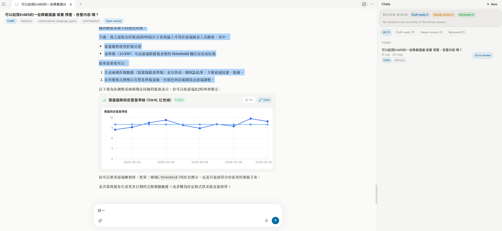
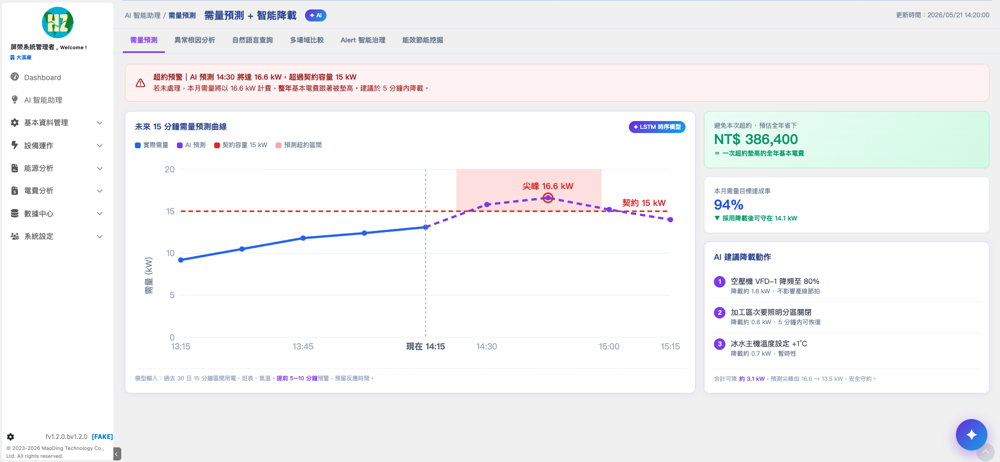
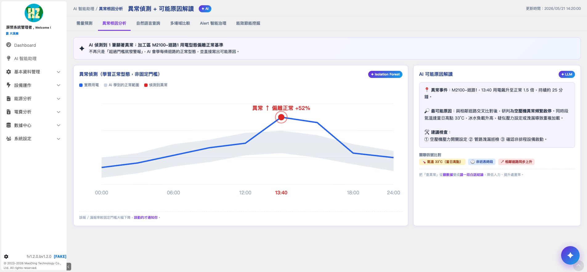
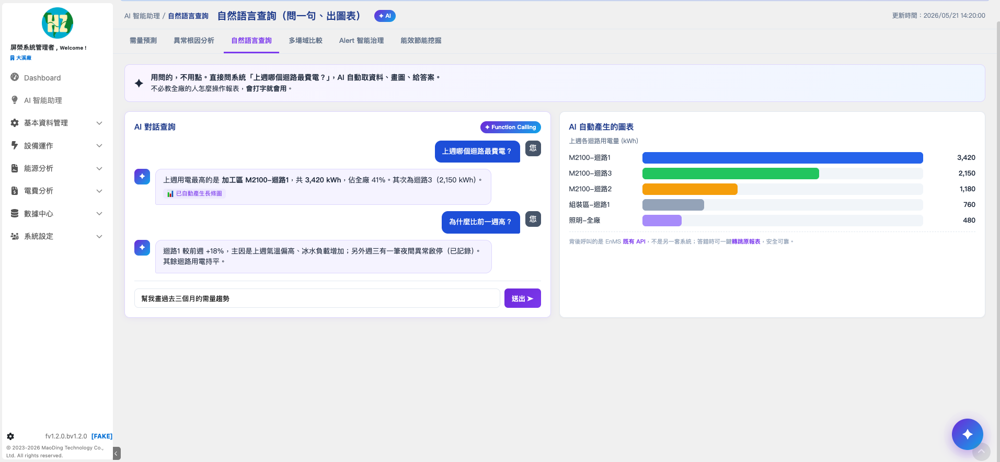
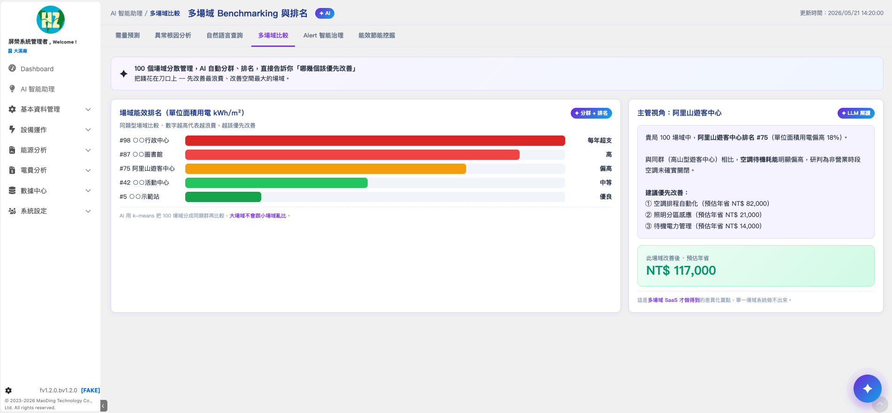
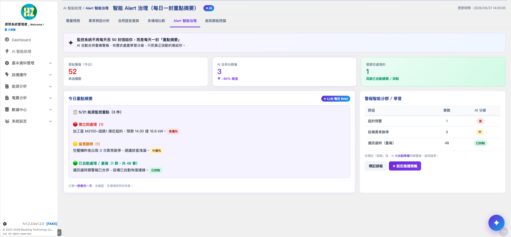
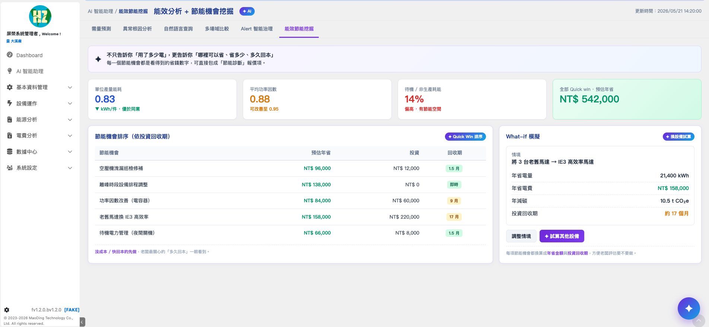
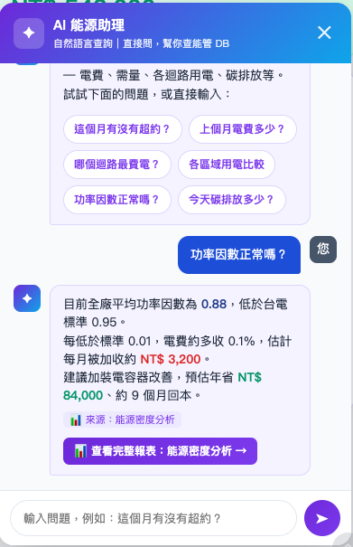

# DenchClaw

> A governed AI runtime for enterprise workflows, currently focused on `Y-CRM`, `ERP`, and `EnMS`.

備註：在 EnMS 對外技術文件中，`EnClaw` 是 `DenchClaw` 在 EnMS 場景下的產品化名稱。

## Current DenchClaw

目前真正運作中的 DenchClaw Web runtime：

<p align="center">
  
</p>

- 真實執行中的 Web runtime，而不是靜態 mockup
- 已具備 `workspace`、`chat runtime`、`review queue`、`domain routing`
- 目前可在同一套 runtime 下承接 `Y-CRM / ERP / EnMS`

## EnMS AI Assistant Surfaces

下列畫面來自目前 EnMS 系統中的 AI 助理分頁設計與互動介面。  
它們不是脫離產品脈絡的靜態設計稿，而是後續要由 EnMS data layer 與 EnClaw runtime 承接的產品化展示面。

### Tab gallery

<table>
  <tr>
    <td align="center"><strong>需量預測 + 智能降載</strong></td>
    <td align="center"><strong>異常根因分析</strong></td>
  </tr>
  <tr>
    <td></td>
    <td></td>
  </tr>
  <tr>
    <td align="center"><strong>自然語言查詢</strong></td>
    <td align="center"><strong>多場域 Benchmarking</strong></td>
  </tr>
  <tr>
    <td></td>
    <td></td>
  </tr>
  <tr>
    <td align="center"><strong>Alert 智能治理</strong></td>
    <td align="center"><strong>能效分析 + 節能機會挖掘</strong></td>
  </tr>
  <tr>
    <td></td>
    <td></td>
  </tr>
</table>

### FAB chat entry

除了分頁式分析界面，也保留了從右下角 FAB button 叫出 AI 對話入口的互動型態：

<p align="center">
  
</p>

這組畫面代表的是 EnMS AI Assistant 的產品化展示面。  
其中 `自然語言查詢`、`需量預警`、`異常偵測`、`Alert 治理` 已有對應的 runtime 主線；  
`多場域比較` 與 `節能 ROI / what-if 模擬` 則會隨資料模型與演算法持續補強。

## What This Repo Actually Contains

這個 repo 目前的核心，不是單一聊天介面，而是可治理、可持續演進的 AI runtime：

- `OpenClaw Gateway Runtime`
  - 承接 `session lifecycle`、`chat route`、`active runs`、`web session persistence`
- `Hermes-style Planner`
  - 負責 `intent classification`、`domain routing`、`chart guardrails`、`risk guardrails`
- `Domain Bootstrap / Gap Governance`
  - 在進模型前檢查 `schema`、`availability`、`join semantics`、`data gaps`
- `EnMS Analytics Runtime`
  - 已具備第一版 `demand forecast`、`anomaly detection`、`alert governance`
- `Chart Runtime`
  - 支援可執行 SQL、`VALUES` 常量與 `inline rows/data`
- `Reviewable Knowledge Loop`
  - 支援 `draft -> review -> writeback -> promotion -> wiki`

## Current Capability Map

### Already operational

- `自然語言查詢`
  - 已有 `planner + bootstrap + context + query runtime + chart runtime`
- `EnMS 需量預警`
  - 已有第一版 baseline / trend / contract-risk 路徑
- `EnMS 異常偵測`
  - 已有 `summary-first + raw-validation` 路徑
- `EnMS 告警治理`
  - 已有 `prewarning / alert` 分級、`owner`、`dedupe`、`escalation window`
- `缺資料治理`
  - 不會只回「資料限制」，會明確說明缺口與仍可回答範圍
- `Review / Promotion`
  - 高價值回答可進入 review 與知識沉澱流程

### EnMS AI Assistant tabs and status

| Tab | Current status |
| --- | --- |
| `需量預測 + 智能降載` | 已有第一版 forecast runtime；更高階 probabilistic forecast 可持續升級 |
| `異常根因分析` | 已有第一版 anomaly / root-cause path |
| `自然語言查詢` | 已可落地 |
| `多場域比較` | routing / context 已具備，peer grouping 與 normalization 持續補強 |
| `Alert 智能治理` | 已有第一版 runtime |
| `能效節能挖掘` | 已有第一版 recommendation path；ROI / what-if simulation 後續補強 |

## Technical References

- [EnMES AIClaw Technical Architecture](docs/EnMES_AIClaw_technical-architecture.html)
- [EnMES AIClaw vs Market EnMS AI](docs/EnMES_AIClaw_enms-ai-market-comparison.html)
- [Platform Overview](docs/denchclaw-ai-architecture-investor.html)
- [Core Technology Snapshot](docs/denchclaw-core-technology.html)

## Quick Start

### Requirements

- `Node.js >= 22.12.0`
- `pnpm >= 10`
- `openclaw >= 2026.1.0`

### Install

```bash
npx denchclaw@latest
```

### Local development

```bash
git clone https://github.com/notyenyu-creator/YM_AIClaw.git
cd YM_AIClaw

pnpm install
pnpm build
pnpm web:dev
```

### Useful commands

```bash
npx denchclaw@latest
npx denchclaw@latest update
npx denchclaw restart
npx denchclaw start
npx denchclaw stop

openclaw --profile dench gateway restart
openclaw --profile dench devices list
```

## Positioning

DenchClaw 的核心價值不是自研基礎模型，而是把：

- 企業資料
- domain routing
- 程式化分析邏輯
- chart runtime
- review / promotion
- knowledge governance

收斂成可持續運作的企業 AI runtime。

在 EnMS 場景下，這條路徑會逐步把現有資料層升級成：

- 可問答
- 可分析
- 可預警
- 可告警治理
- 可知識沉澱

的 AI decision layer。

## License

[MIT](LICENSE)
