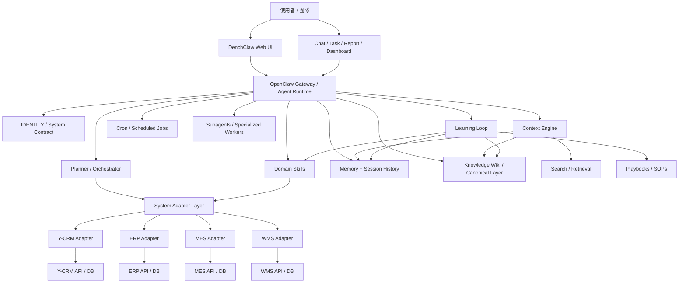
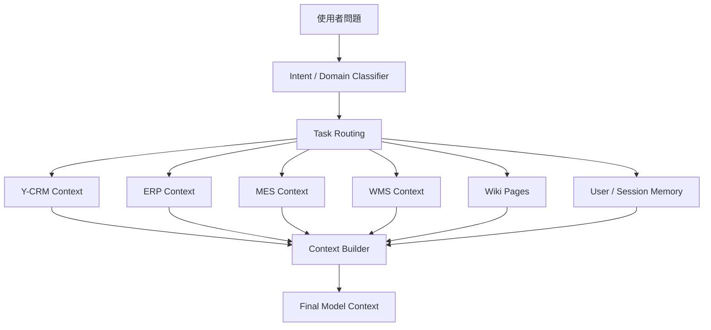
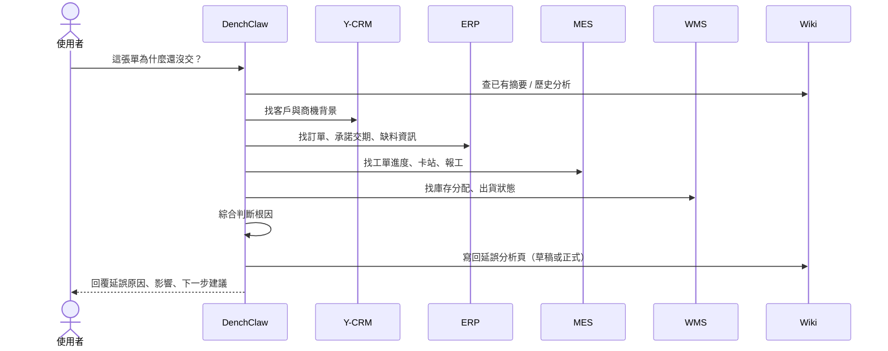
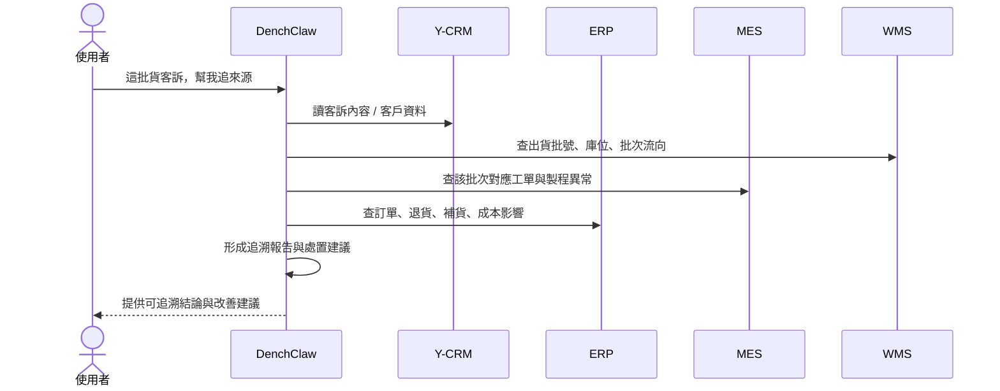

# DenchClaw × Y-CRM × ERP × MES × WMS 融合架構設計

> 產生日期：2026-04-16
> 狀態：規劃版 v1

## 1. 設計目標

這份設計的目標不是把 DenchClaw 變成另一套 ERP / CRM / MES / WMS / EMS，而是讓 DenchClaw 成為一個可跨系統協作、可持續累積知識、可逐步自我優化的 AI Operating Layer。

未來 DenchClaw 需要同時處理：

- **Y-CRM**：客戶、聯絡人、商機、互動、需求脈絡
- **ERP**：訂單、採購、庫存、財務、成本、交期承諾
- **MES**：工單、製程、設備、報工、良率、異常
- **WMS**：庫位、入庫、出庫、批號、揀貨、波次、移倉
- **EMS**：能源/設備/環境監控等產品系統（待後續定義）

核心設計原則：

1. **一系統一 Adapter，一領域一 Skill**
2. **跨系統知識不直接塞進 prompt，而是編譯進 Wiki / Knowledge Layer**
3. **模型不是靠重訓變聰明，而是靠記憶、上下文、技能與知識沉澱變聰明**
4. **先唯讀、後寫入；先觀察、後自動化**
5. **所有結論都要能追溯來源系統與原始證據**

---

## 2. 最終願景

DenchClaw 的最終定位：

> **一個以 CRM 為商業入口，橫跨 ERP、MES、WMS、EMS 的企業 AI 操作與知識編譯系統。**

它不只是聊天介面，而是同時具備：

- 跨系統查詢與分析
- 工作流程編排
- 長期知識沉澱
- 使用者與組織偏好記憶
- 可審計、可控的寫入行為
- 隨使用逐步優化的 Skill / Playbook / Wiki

---

## 3. 整體架構總覽



---

## 4. 建議的六層架構

### Layer 1: Experience Layer（使用者互動層）

這是 DenchClaw Web 直接呈現給使用者的層：

- Chat
- Dashboard
- Report
- Workspace
- Task / Job / Timeline
- Entity Card（客戶、訂單、工單、庫存項）

這一層的任務是把 AI 能力呈現為可操作的 UI，而不是讓使用者只看到純聊天回覆。

### Layer 2: Agent Runtime Layer（代理執行層）

由 Gateway / Agent Runner / Subagents / Cron 組成。

主要職責：

- 理解任務
- 路由到正確 skill
- 啟動子代理執行特定子任務
- 控制工具呼叫順序
- 監控長任務與背景任務
- 保存 session 與運行狀態

這層相當於 Hermes 類型系統最有價值的部分，但不需要把 Hermes 整套搬進來。

### Layer 3: Context & Memory Layer（上下文與記憶層）

這層是 DenchClaw 變聰明的關鍵。

它不是單純塞更多 prompt，而是每回合動態選出：

- 目前使用者與 workspace 身分
- 最近對話摘要
- 相關 wiki 頁面
- 相關 entity 摘要
- 已知偏好與固定流程
- 最近失敗經驗與注意事項

目的：讓每次回合都帶著最必要、最乾淨的上下文，而不是把所有資料全部丟給模型。

### Layer 4: Canonical Knowledge Layer（統一知識層）

這一層建議採用 **AI Wiki / Knowledge Layer** 的做法，而不是單靠即時 RAG。

資料分成三層：

- `raw/`：原始來源，不可修改
- `wiki/`：AI 維護的知識頁
- `schema/`：規範 AI 如何 ingest / query / lint / maintain

這是 Karpathy 提出的 `LLM Wiki` 模式最適合 DenchClaw 的部分。

### Layer 5: Adapter & Integration Layer（外部系統接入層）

每個系統獨立一個 adapter：

- `ycrm-adapter`
- `erp-adapter`
- `mes-adapter`
- `wms-adapter`

每個 adapter 專職處理：

- 連線方式
- schema 探查
- 認證
- object / table 映射
- 標準查詢
- 標準寫入 action
- 風險控制與 audit metadata

這樣模型不需要直接知道每個系統的所有 API 細節。

### Layer 6: System of Record Layer（真實資料層）

這一層是真正的來源系統：Y-CRM / ERP / MES / WMS。

DenchClaw 不應取代它們，而應：

- 讀取
- 彙整
- 解釋
- 編排
- 在受控情況下寫回

---

## 5. 各系統角色定位

| 系統 | 主要角色 | 典型資料 | AI 問題類型 |
|------|----------|----------|-------------|
| **Y-CRM** | 商業關係中心 | 客戶、聯絡人、商機、活動、筆記 | 誰是客戶？目前關係如何？這案子推進到哪？ |
| **ERP** | 交易與資源中心 | 訂單、採購、庫存、發票、成本 | 訂單現在狀態？缺料嗎？成本與交期怎麼看？ |
| **MES** | 現場執行中心 | 工單、工序、報工、設備、良率、異常 | 工單做到哪？延誤原因？品質異常在哪一站？ |
| **WMS** | 倉儲與物流中心 | 庫位、批號、入出庫、波次、揀貨、移倉 | 料在哪？有多少可用庫存？哪批貨出錯？ |

這樣切分後，DenchClaw 的回答就不會混亂：

- 問「客戶脈絡」優先看 Y-CRM
- 問「金額與訂單」優先看 ERP
- 問「生產進度」優先看 MES
- 問「實際庫位與批號」優先看 WMS

---

## 6. Source of Truth 設計

跨系統後最重要的是：**不要讓模型自己猜哪邊才是真相。**

建議先定義固定規則：

| 主題 | Source of Truth |
|------|-----------------|
| 客戶主資料 | Y-CRM |
| 聯絡互動紀錄 | Y-CRM |
| 訂單金額 / 開單狀態 | ERP |
| 採購 / 財務 / 應收應付 | ERP |
| 工單進度 / 報工 / 良率 | MES |
| 庫位 / 批號 / 入出庫 / 波次 | WMS |
| 跨系統摘要 / 經營洞察 / SOP | Wiki Layer |

如果系統彼此衝突，DenchClaw 必須：

1. 指出衝突
2. 標註資料來源
3. 依 source-of-truth 規則決定主版本
4. 必要時寫入 wiki 的 `conflict note`

---

## 7. Canonical Ontology 設計

未來一定要有一份跨系統的 `ontology.md`。建議最小核心物件如下：

```text
Customer
Contact
Company
Product
Quote
SalesOrder
PurchaseOrder
InventoryItem
InventoryLot
Shipment
WorkOrder
OperationStep
Machine
QualityIssue
Warehouse
BinLocation
Task
Incident
```

每個物件都應定義：

- `business definition`
- `source systems`
- `source-of-truth`
- `primary identifier`
- `cross-system aliases`
- `readability / writability`
- `sensitivity level`
- `canonical fields`

例如：

### `SalesOrder`

- 定義：客戶下單後的正式銷售訂單
- 來源系統：ERP, WMS, MES
- Source of Truth：ERP
- 相關延伸：
  - WMS 追蹤出貨與庫存分配
  - MES 追蹤生產工單與在製進度
- Canonical fields：
  - `sales_order_no`
  - `customer_id`
  - `status`
  - `order_date`
  - `due_date`
  - `amount`
  - `currency`
  - `warehouse`
  - `production_status`
  - `shipment_status`

這一層會極大影響未來 agent 的穩定度。

---

## 8. Wiki / Knowledge Layer 設計

建議新增以下目錄：

```text
~/.openclaw-dench/workspace/
├── raw/
│   ├── ycrm/
│   ├── erp/
│   ├── mes/
│   ├── wms/
│   ├── meetings/
│   └── docs/
├── wiki/
│   ├── entities/
│   │   ├── customers/
│   │   ├── companies/
│   │   ├── products/
│   │   ├── machines/
│   │   └── warehouses/
│   ├── operations/
│   │   ├── order-fulfillment/
│   │   ├── procurement/
│   │   ├── production/
│   │   └── warehouse/
│   ├── playbooks/
│   ├── analysis/
│   ├── reports/
│   ├── index.md
│   └── log.md
├── schema/
│   ├── AGENTS.md
│   ├── ontology.md
│   ├── source-of-truth.md
│   ├── ingest-rules.md
│   └── write-policies.md
└── skills/
    ├── ycrm/
    ├── erp/
    ├── mes/
    └── wms/
```

### Wiki 的三種核心操作

#### 1. Ingest

新來源進來後：

- 讀取原始來源
- 產生摘要頁
- 更新 index
- 更新相關 entity / concept / process 頁
- 寫入 log

#### 2. Query

查詢時：

- 先讀 `wiki/index.md`
- 再讀相關實體頁與流程頁
- 必要時才回頭打原始系統
- 新分析結果若有長期價值，寫回 wiki

#### 3. Lint

定期健康檢查：

- 找矛盾
- 找過期資訊
- 找沒有連結的孤兒頁
- 找重複概念
- 找缺少 source-of-truth 標記的內容

---

## 9. Context Engine 設計

建議 Context Engine 不是通用 prompt glue，而是可明確配置的選材機制。



### 範例：不同問題如何選上下文

#### 問題 A：
「OOCHAIN 這張單為什麼還沒交？」

Context Engine 應優先抓：

- 客戶與單號關聯：Y-CRM
- 訂單狀態與承諾交期：ERP
- 在製與卡關工序：MES
- 是否缺貨 / 未出庫：WMS
- 既有歷史分析頁：Wiki

#### 問題 B：
「某個產品最近客訴很多，原因可能是什麼？」

Context Engine 應優先抓：

- 客訴或商機互動：Y-CRM
- 該產品近期出貨批次：WMS
- 對應工單與良率：MES
- 退貨 / 補貨 / 財務影響：ERP
- 過去異常頁與 SOP：Wiki

這種精準選材，比直接用超大 context window 更實際。

---

## 10. Learning Loop 設計

DenchClaw 的「自己學習」應定義為以下四種可控能力：

### A. Memory Learning

記住：

- 使用者偏好
- 慣用報表格式
- 名詞別名
- 常用工作流
- 固定合作夥伴與系統對照

### B. Wiki Learning

把高價值輸出沉澱成頁面：

- 客戶摘要
- 供應商風險分析
- 工單異常分析
- 倉儲作業 SOP
- 月度經營洞察

### C. Skill Learning

把成功的操作模式整理回 skill：

- 新欄位對照
- 新 API 範例
- 常見 SQL pattern
- 常見錯誤處理

### D. Playbook Learning

把跨系統流程固化成 SOP：

- 追交期延誤
- 查庫存差異
- 查缺料原因
- 查客訴批號追溯
- 建立客戶拜訪前簡報

### 建議原則

一開始不要做全自動自學，建議採用：

- `auto-draft`
- `human approve`
- `write back`

這樣可以避免把錯誤知識沉澱進系統。

---

## 11. 寫入風險分級

建議未來所有 action 都要有風險分級：

| 等級 | 類型 | 例子 | 建議策略 |
|------|------|------|----------|
| L0 | 純讀取 | 查詢客戶、查詢工單、查詢庫存 | 直接允許 |
| L1 | 低風險寫入 | 新增筆記、建立內部標記、加入分析頁 | 可預設允許 |
| L2 | 一般業務寫入 | 建立 CRM 任務、更新商機狀態、建立草稿工單 | 顯示確認 |
| L3 | 高風險營運寫入 | 改訂單、調整庫存、建立出貨單、更新報工 | 必須人工確認 + audit |
| L4 | 關鍵寫入 | 過帳、財務確認、庫存盤點結轉、作廢關鍵單據 | 禁止直接執行或需雙重授權 |

這套分級對 ERP / MES / WMS 特別重要。

---

## 12. 建議的 Domain Skills

```text
skills/
├── ycrm/
│   ├── customer-insight
│   ├── opportunity-analysis
│   └── relationship-summary
├── erp/
│   ├── order-tracking
│   ├── procurement-analysis
│   ├── inventory-finance-bridge
│   └── invoice-risk-check
├── mes/
│   ├── workorder-diagnosis
│   ├── production-delay-analysis
│   ├── quality-root-cause
│   └── machine-utilization
└── wms/
    ├── inventory-trace
    ├── lot-traceability
    ├── picking-shipping-analysis
    └── warehouse-anomaly-check
```

每個 skill 都應包含：

- 連線方式
- schema 探查流程
- object mapping
- query 範本
- write policy
- source-of-truth 提醒
- 常見異常排查流程

---

## 13. 建議的 Adapter 標準介面

未來最好把所有外部系統抽成統一介面：

```ts
interface SystemAdapter {
  system: "ycrm" | "erp" | "mes" | "wms";
  discoverSchema(): Promise<SchemaSummary>;
  searchEntities(input: SearchInput): Promise<SearchResult[]>;
  fetchEntity(input: FetchEntityInput): Promise<EntityPayload>;
  query(input: StructuredQuery): Promise<QueryResult>;
  executeAction(input: ActionRequest): Promise<ActionResult>;
  explainConflict?(input: ConflictInput): Promise<ConflictResolution>;
}
```

這樣做的好處：

- Gateway 可以共用 routing
- Skills 可以共用抽象語義
- 未來換系統時 adapter 可替換
- 更容易做 observability 與 audit

---

## 14. 未來工作流範例

### 範例一：訂單延誤分析



### 範例二：客訴批號追溯



---

## 15. 分階段實作建議

### Phase 1：雙系統閉環（Y-CRM + ERP）

先完成：

- `erp` skill
- ERP adapter
- Customer / SalesOrder ontology
- 訂單追蹤與客戶摘要
- CRM + ERP 的 context routing
- 基本 wiki 結構

**目標：** 先做到「從客戶到訂單」的商業閉環。

### Phase 2：加入 MES

新增：

- MES adapter
- WorkOrder / OperationStep / Machine ontology
- 交期延誤與在製分析
- 生產異常分析 playbook

**目標：** 做到「從接單到生產」的端到端分析。

### Phase 3：加入 WMS

新增：

- WMS adapter
- InventoryLot / Warehouse / BinLocation ontology
- 批號追溯
- 出貨與庫位分析

**目標：** 補齊「從生產到倉儲出貨」。

### Phase 4：Learning Loop + Governance

新增：

- wiki ingest / lint / log
- memory profile
- playbook auto-draft
- skill patch proposal
- action risk governance
- audit trail

**目標：** 讓 DenchClaw 從好用變成會持續進化。

---

## 16. 我對目前 DenchClaw 的建議結論

對你現在的情境，最值得先做的不是再加更多模型，而是先把以下三件事定型：

1. **Canonical Ontology**
   否則 Y-CRM / ERP / MES / WMS 一進來後，模型只會更混亂。

2. **Wiki / Knowledge Layer**
   否則每次都從原始系統重算，無法累積組織智慧。

3. **Context Engine**
   否則小模型永遠會因為上下文選材錯誤而失真。

如果這三件事打穩，DenchClaw 就會從「會呼叫工具的 AI」升級成「會編譯企業知識、協調跨系統作業的 AI 操作層」。

---

## 17. 下一步建議

下一步建議的實作順序：

1. 新增 `schema/ontology.md`
2. 新增 `schema/source-of-truth.md`
3. 建立 `wiki/` 基礎目錄與 `index.md` / `log.md`
4. 先落地 `erp` skill 與 adapter 規格
5. 在 gateway 前加入第一版 context builder
6. 再接 `mes` 與 `wms`

如果這份規劃確認沒問題，下一階段就可以開始實作：

- `schema/ontology.md` 初版
- `schema/source-of-truth.md` 初版
- `wiki/` 骨架
- `skills/erp` / `skills/mes` / `skills/wms` 模板
- `context engine` 的第一版資料路由規則
