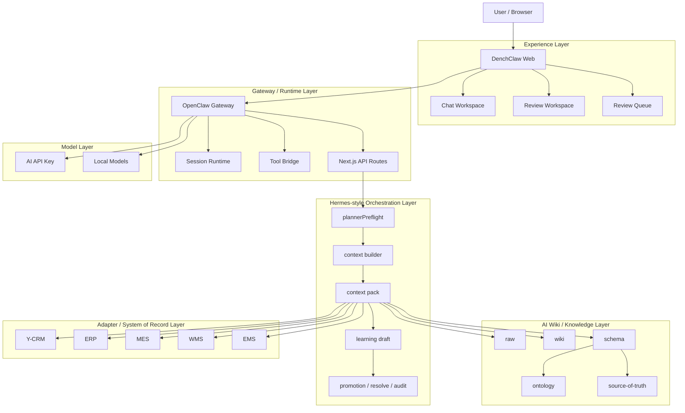
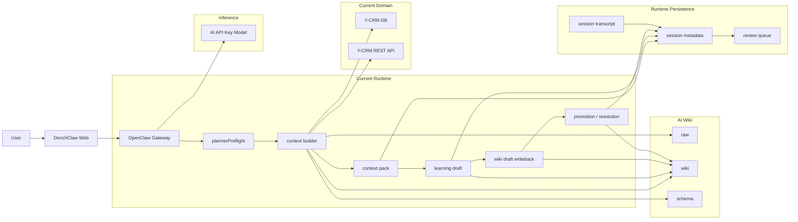
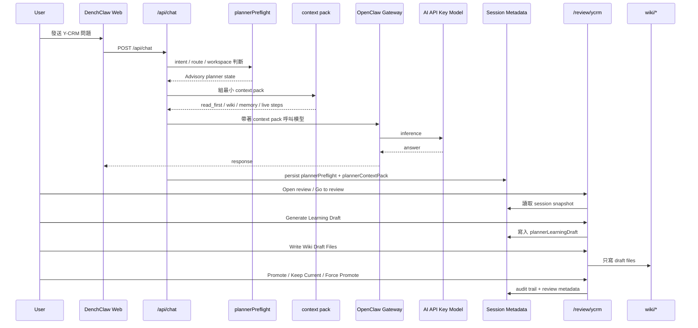
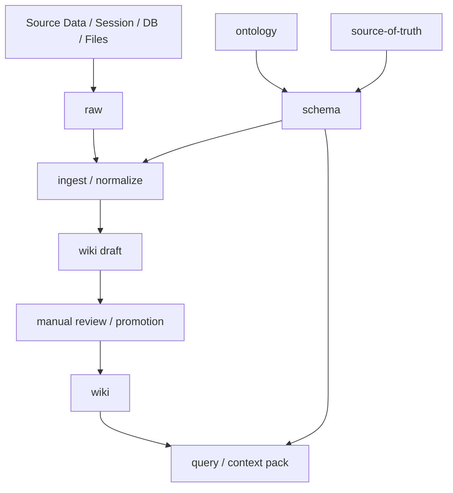
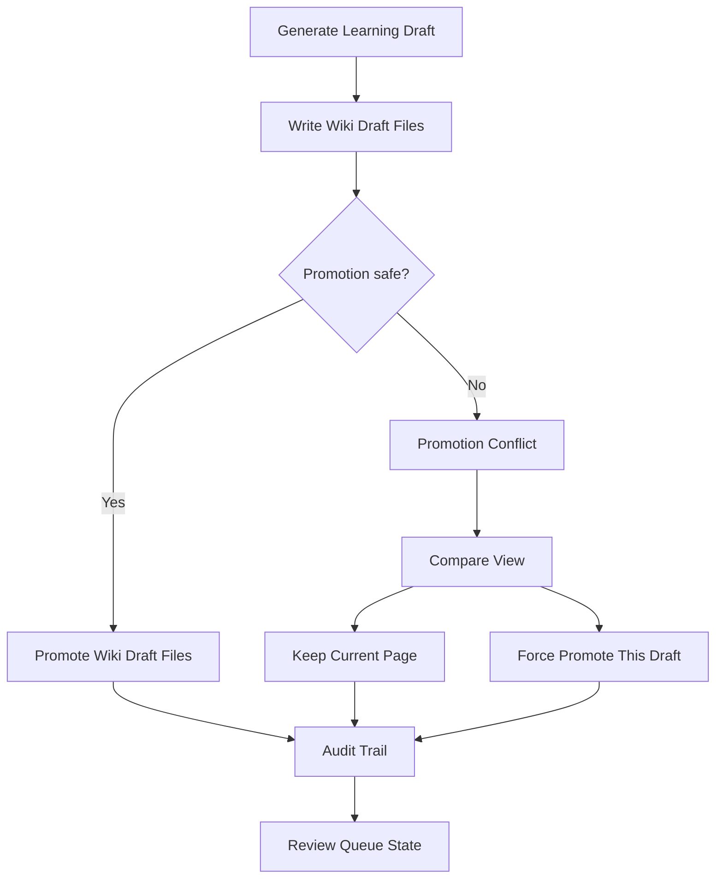
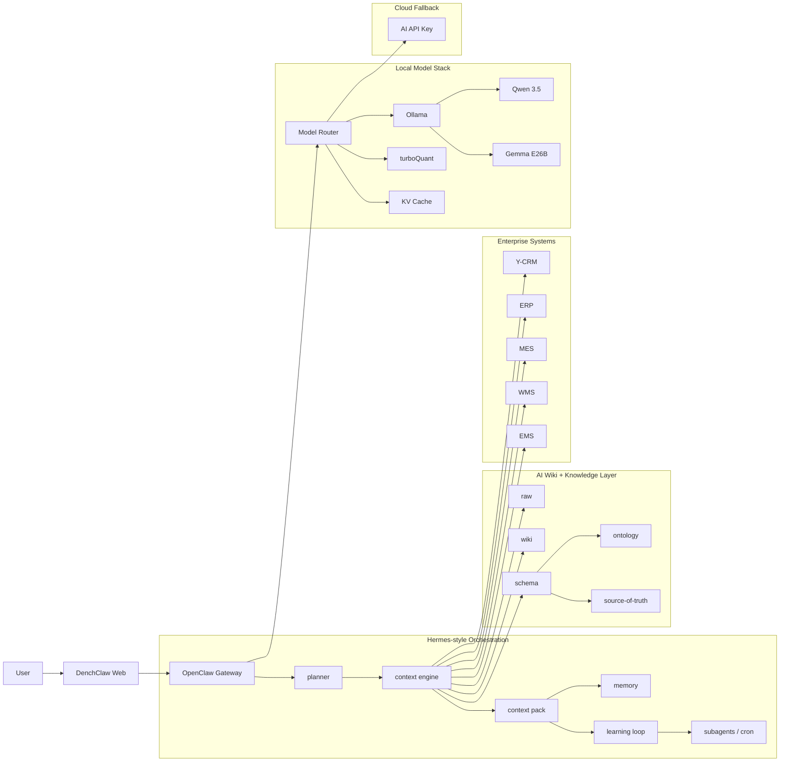
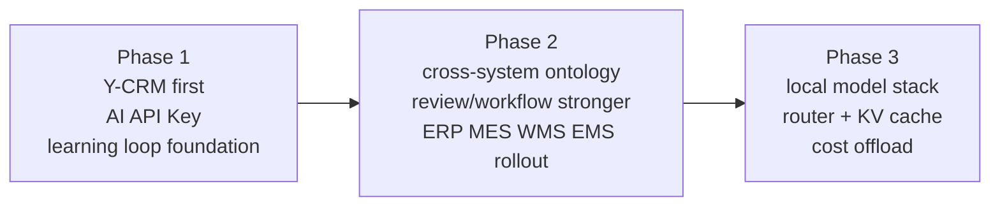

# DenchClaw OpenClaw Gateway + Hermes-style Orchestration + AI Wiki 最終版架構圖與演進路線

> 更新日期：2026-04-19
> 狀態：最終版整理，區分目前可運作版本與未來本地模型演進版本
> 目的：把 `OpenClaw Gateway`、`Hermes-style orchestration`、`Karpathy AI Wiki`、`AI API Key 現況` 與 `未來本地模型堆疊` 一次講清楚

---

## 1. 一句話定位

目前 DenchClaw 的正確定位不是：

- 再外掛一整套新的 Hermes runtime

而是：

- 保留 `OpenClaw Gateway` 當底盤
- 吸收 `Hermes Agent` 的工作方式
- 用 `AI Wiki` 當知識層
- 目前先跑 `AI API Key` 模式
- 未來再把推理層切到 `本地模型優先、雲端 fallback`

也就是說：

> `OpenClaw Gateway` 是底盤。  
> `Hermes-style orchestration` 是工作流程。  
> `AI Wiki` 是知識層。  
> `Model Layer` 是可替換的推理層。

---

## 2. 設計原則

### 2.1 不做框架疊框架

- `OpenClaw Gateway` 不替換
- `Hermes` 借方法，不搬整套 runtime
- `AI Wiki` 是知識編譯層，不是第二個 prompt 倉庫

### 2.2 先把腦的結構做好，再換推理引擎

先做：

- planner
- context engine
- learning loop
- review / audit
- AI Wiki

再做：

- 本地模型
- model router
- KV cache

### 2.3 先 Y-CRM 封板，再多系統擴張

目前策略是：

- 先把 `Y-CRM` 做成第一個完整樣板
- 再把同樣骨架擴到 `ERP / MES / WMS / EMS`

### 2.4 Rolling Window / Rolling Summary 的正確放置位置

為了避免把系統搞亂，`Rolling Window + Rolling Summary` 目前不放在新的獨立 runtime 裡，而是放在：

- `DenchClaw Web / API` 前置壓縮層
- 屬於 `Hermes-style orchestration` 的一部分

它的角色是：

- 幫送進 `OpenClaw Gateway` 的單輪 message 做 `continuity compaction`
- 用很薄的 `recent window + rolling summary` 承接需要的前文
- 降低單輪 prompt 膨脹
- 不搶走 Gateway 本身的 session memory 主導權

所以這層的邊界要很清楚：

- 不取代 `OpenClaw Gateway` 的 session runtime
- 不取代 `AI Wiki` 的 durable knowledge
- 不把整個系統改成第二套 chat history engine

---

## 3. 分層總覽圖

### 這張圖在講什麼

- `OpenClaw Gateway` 是唯一底盤，不做雙 runtime
- `Hermes-style orchestration` 是中間那層工作流，不是另一套平台
- `AI Wiki` 是知識底座，跟推理層分開
- `Model Layer` 可替換，所以現在能用 API Key，未來也能接本地模型

---

## 4. 目前版總架構圖：AI API Key 模式

### 目前版的重點

- 真的已經落地的 domain 是 `Y-CRM`
- learning loop 已形成人工可治理的閉環
- review 已可從主流程進入，不再只有 debug page
- 推理層目前仍是 `AI API Key`

---

## 5. 目前版核心流程圖

### 目前版最重要的特徵

- `plannerPreflight` 明確是 `Advisory`
- `review` 已進正式 route：`/review/ycrm`
- `writeback` 先寫 draft files，再 promotion
- `human-in-the-loop` 已存在

---

## 6. AI Wiki 知識層圖

### AI Wiki 在這裡的角色

- `raw`：放原始來源
- `wiki`：放編譯後知識
- `schema`：放 ontology / source-of-truth / 規則

這層最重要的是：

`AI Wiki 是知識層，不是第二個 prompt 倉庫。`

---

## 7. 治理與審核流程圖

### 這張圖的重點

- phase-1 已經不是「直接寫回」
- 而是「draft -> check -> promote or resolve」
- `reviewer_actor / review_reason / reviewer_note / timeline` 已形成正式治理基礎

---

## 8. 未來版總架構圖：本地模型模式

### 未來版本的核心變化

- 推理層從單一 API key 變成可路由
- 本地模型優先，雲端 fallback
- context engine 會真正跨 `Y-CRM / ERP / MES / WMS / EMS`
- `KV Cache` 與 `turboQuant` 屬於推理優化層，不是知識層

---

## 9. 模型模式對照表

| 面向 | 目前版 | 未來版 |
|------|--------|--------|
| 推理主路徑 | `AI API Key` | `Local preferred + Cloud fallback` |
| 模型路由 | 幾乎沒有 | `Model Router` |
| 小模型任務 | 尚未正式分流 | routing / summarization / maintenance |
| 大模型任務 | 主要由雲端模型承擔 | 複雜分析、長鏈推理 |
| 成本控制 | manual trigger + minimal evidence | local inference + KV cache + router |
| 知識層 | AI Wiki 骨架已落地 | AI Wiki 持續擴到多系統 |

---

## 10. 路線圖

### Phase 1 完成條件

- `Y-CRM` 主流程閉環
- review queue 可操作
- audit trail 可追溯
- AI Wiki 可安全 writeback

### Phase 2 完成條件

- ontology / source-of-truth 跨系統成立
- `ERP / MES / WMS / EMS` 至少部分接入
- review / governance 再強化

### Phase 3 完成條件

- 本地模型堆疊正式上線
- model router 成立
- cloud fallback 成本顯著下降

---

## 11. 最後結論

如果用最精簡的一句話定義這套架構：

> DenchClaw 不是要變成第二個 Hermes，而是要以 `OpenClaw Gateway` 為底盤，吸收 `Hermes-style orchestration` 的工作方式，再用 `AI Wiki` 變成真正會累積公司知識的企業 AI 系統。

如果再對應到你現在的現況與未來：

> 現在是 `AI API Key + Y-CRM first` 的 phase-1 樣板；未來則是 `Local model preferred + cross-system knowledge orchestration` 的企業內部 AI 平台。
