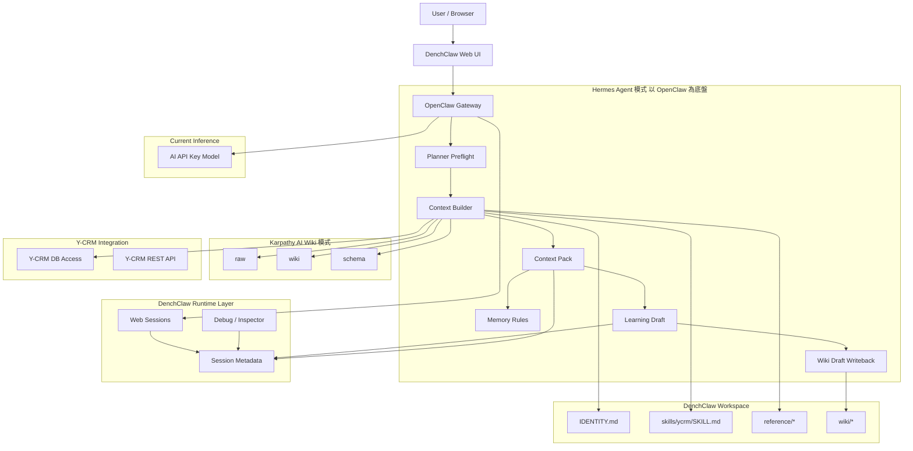
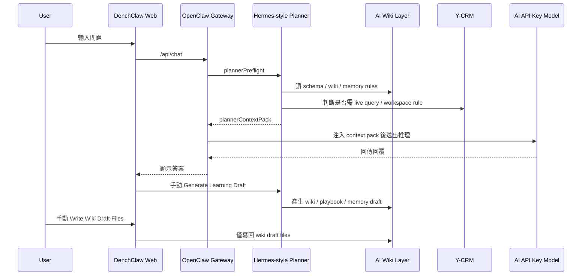
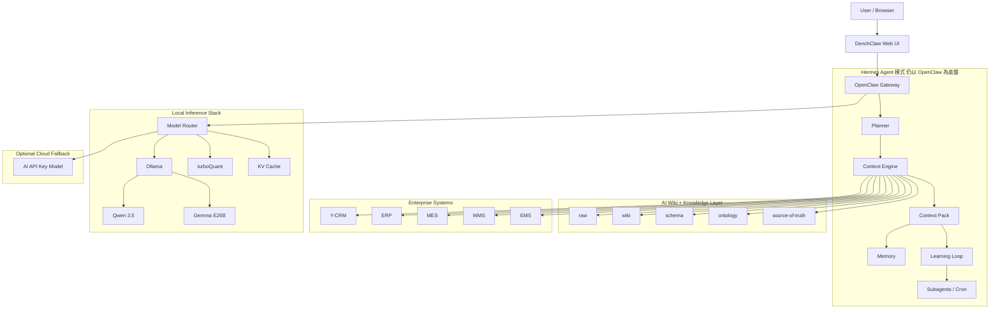
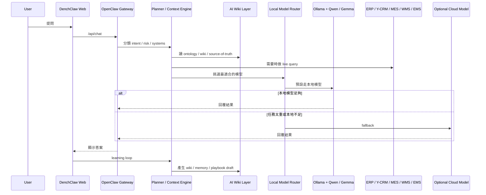

# DenchClaw OpenClaw Gateway + Hermes Agent 模式 + AI Wiki 目前與未來架構圖

> 更新日期：2026-04-18
> 目的：釐清 DenchClaw 目前如何在 `OpenClaw Gateway` 底盤上，吸收 `Hermes Agent` 的 orchestration 模式與 `Karpathy AI Wiki` 的知識編譯模式，並規劃未來加入本地模型堆疊後的演進方向。

---

## 1. 先講結論

DenchClaw 目前最合理的方向不是：

- 再外掛一整套新的 Hermes runtime

而是：

- 保留 `OpenClaw Gateway` 當入口與底盤
- 吸收 `Hermes Agent` 的方法論
- 吸收 `AI Wiki` 的知識層設計
- 再逐步把推理層從 `AI API Key` 擴展到 `本地模型`

也就是說：

> `OpenClaw Gateway` 是殼。  
> `Hermes Agent` 提供 orchestration pattern。  
> `AI Wiki` 提供 knowledge layer。  
> `Model Provider` 則是可替換的推理層。

---

## 2. 設計原則

為了避免「框架疊框架」造成反效果，這份融合架構遵守以下原則：

1. `OpenClaw Gateway` 不替換
   - 它仍然是 session、tool bridge、模型呼叫、插件與工作區的進入點。

2. `Hermes Agent` 只借模式，不搬整套 runtime
   - 主要借用：
   - planner
   - context engine
   - memory
   - learning loop
   - subagent / cron orchestration

3. `AI Wiki` 是知識編譯層，不是第二個 prompt 倉庫
   - 用 `raw / wiki / schema` 來沉澱企業知識，而不是把大量 markdown 直接塞進 prompt。

4. `Context pack` 只拿當下真正需要的上下文
   - 不做全量塞入，避免 token 爆炸。

5. `Learning loop` 先以安全、節制為原則
   - 先 `manual trigger`
   - 先 `single_session_single_draft`
   - 先 `minimal_evidence`
   - 先只寫回 `wiki draft files`

---

## 3. 目前架構圖：API Key 模式

### 這張圖代表什麼

- `OpenClaw Gateway` 仍然是總入口。
- `Hermes Agent` 的價值是體現在 `Planner -> Context Builder -> Context Pack -> Learning Draft` 這條流程，不是獨立 runtime。
- `AI Wiki` 則是 `raw / wiki / schema` 這層，提供可沉澱、可編譯、可檢查的知識底盤。
- 目前推理層仍然是 `AI API Key Model`。

### 目前已經落地的部分

- `plannerPreflight`
- `plannerContextPack`
- `session metadata visibility`
- `chat panel / sidebar planner badges`
- `Y-CRM learning draft`
- `manual wiki draft writeback`
- `token-saving guardrails`

### 目前還沒有做的部分

- 真正的多系統 context router
- ERP / MES / WMS / EMS adapter
- learning loop 的 approval workflow
- 自動化 wiki ingest / lint pipeline
- 多模型 routing

---

## 4. 目前運作流程

### 重點

- 目前 learning loop 不是自動全開，而是「先人工觸發、先寫 draft」。
- 這樣可以讓 API key 成本維持可控，也能降低錯誤知識沉澱的風險。

---

## 5. 未來架構圖：加入本地模型堆疊

### 未來版的核心變化

1. 推理層變成可路由
   - 不再只依賴單一 API key 模型。

2. 本地模型分工
   - `Qwen 3.5` 可做日常 routing、整理、輕量規劃。
   - `Gemma E26B` 可做較重的分析與長鏈推理。
   - `KV Cache` 用來降低長上下文重複成本。
   - `turboQuant` 用來壓低本地部署成本。

3. 雲端模型變成 fallback
   - 當本地模型不夠、或特殊任務需要更強推理時，再退回 `AI API Key`。

4. 多系統真正進場
   - Y-CRM 不再是唯一系統，而是與 `ERP / MES / WMS / EMS` 一起進入 context engine。

---

## 6. 未來運作流程

---

## 7. 為什麼這樣不會反效果

### 真正會反效果的做法

- 再塞一整套獨立 Hermes runtime
- 做兩套 planner
- 做兩套 memory
- 把 AI Wiki 當第二套 prompt 倉庫
- 讓 learning loop 每回合全自動重跑

### 目前這份設計避免了這些問題

- `Gateway` 仍只有一套：OpenClaw Gateway
- `planner` 只有一套：DenchClaw 內建前置流程
- `memory / draft / writeback` 都走同一套 session metadata 與 workspace/wiki 路徑
- `AI Wiki` 只做知識層，不搶 runtime 主導權
- `learning loop` 先採節制模式，避免 token 與錯誤知識暴增

---

## 8. 目前版與未來版的差異表

| 面向 | 目前版 | 未來版 |
|------|--------|--------|
| Gateway | OpenClaw Gateway | OpenClaw Gateway |
| Planner 模式 | Hermes-style preflight + context pack | Hermes-style full context engine |
| Knowledge Layer | Y-CRM 為主的 wiki / schema | 跨 ERP / Y-CRM / MES / WMS / EMS |
| Model Provider | AI API Key | 本地模型為主，雲端 fallback |
| Learning Loop | 手動 draft + 手動 writeback | 可擴展成 approval workflow |
| 成本控制 | manual trigger + cache reuse | local inference + KV cache + router |
| 主要風險 | API token 成本、上下文品質 | 多系統治理、模型路由複雜度 |

---

## 9. 建議的下一步

如果延續目前這條路，我建議順序是：

1. 先把 `Y-CRM learning loop` 做穩
   - 先把 `draft -> review -> wiki writeback` 跑順

2. 再把 `ontology / source-of-truth` 擴到跨系統
   - 為 ERP / MES / WMS / EMS 做準備

3. 再做 `model router`
   - 先支援 `local preferred / cloud fallback`

4. 最後才逐步把本地模型堆疊接進來
   - `Ollama`
   - `Qwen 3.5`
   - `Gemma E26B`
   - `turboQuant`
   - `KV Cache`

---

## 10. 一句話總結

> DenchClaw 不是要變成第二個 Hermes。  
> 它是要以 `OpenClaw Gateway` 為底盤，吸收 `Hermes Agent` 的工作方式，再用 `AI Wiki` 變成真正會累積公司知識的企業 AI 系統。
