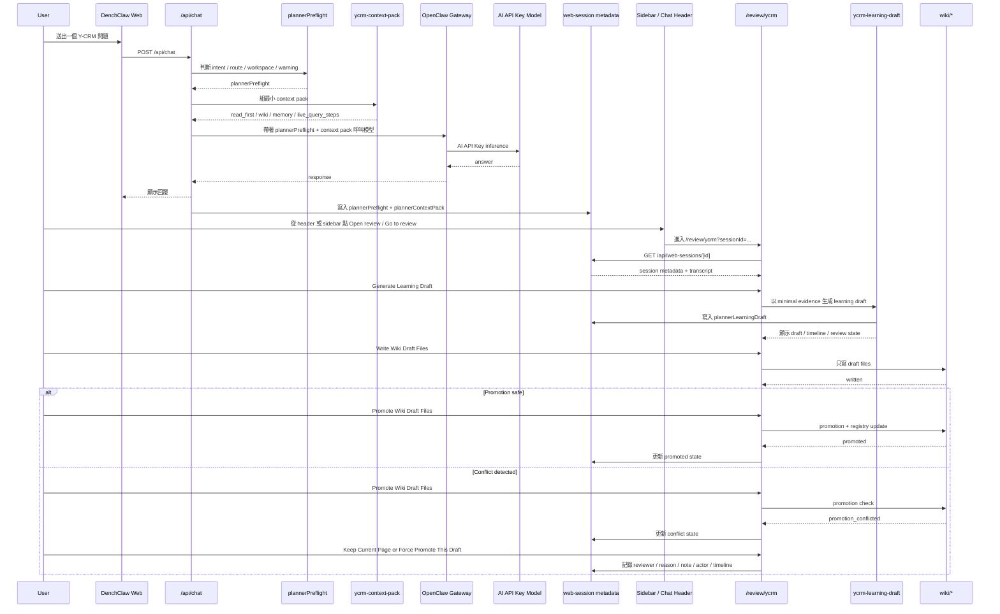

# DenchClaw Y-CRM 實作封板版 系統架構圖與流程圖

> 更新日期：2026-04-19
> 狀態：依目前已落地實作整理，反映 phase-1 可封板樣板現況
> 範圍：`Y-CRM` domain pilot、`OpenClaw Gateway` 底盤、`Hermes-style orchestration`、`AI Wiki` 知識層、`AI API Key` 推理模式

---

## 1. 這份圖是什麼

這份文件只畫「目前真的已經做出來、而且正在 `3200` 上運作的版本」。

也就是說，這裡畫的不是未來想像中的最終企業 AI 平台，而是目前這一段已經封板接近完成的實作：

- `OpenClaw Gateway` 當底盤
- `DenchClaw Web` 當操作介面
- `Y-CRM plannerPreflight + context pack + learning draft + review queue`
- `AI Wiki` 以 `wiki / schema / ontology / source-of-truth` 形式落地
- 推理層目前仍是 `AI API Key`

---

## 2. 目前系統架構圖

```mermaid
flowchart TD
    User[User / Browser] --> Web[DenchClaw Web UI<br/>localhost:3200]

    subgraph UI[UI Layer]
        Sidebar[Session Sidebar<br/>review queue summary + filters]
        ChatHeader[Chat Panel Header<br/>planner + review status + next hint]
        ReviewRoute[Review Workspace<br/>/review/ycrm]
        DebugPage[Debug Utilities<br/>/debug/ycrm-context-builder]
    end

    Web --> Sidebar
    Web --> ChatHeader
    Web --> ReviewRoute
    Web --> DebugPage

    subgraph API[Next.js API Layer]
        ChatRoute[/api/chat]
        WebSessions[/api/web-sessions + /[id]/]
        DebugBuilder[/api/debug/ycrm-context-builder]
        DebugLearning[/api/debug/ycrm-learning-draft]
        DebugWriteback[/api/debug/ycrm-learning-draft/writeback]
        DebugPromote[/api/debug/ycrm-learning-draft/promote]
        DebugResolve[/api/debug/ycrm-learning-draft/resolve]
    end

    Web --> ChatRoute
    Web --> WebSessions
    Web --> DebugBuilder
    Web --> DebugLearning
    Web --> DebugWriteback
    Web --> DebugPromote
    Web --> DebugResolve

    Sidebar --> ReviewRoute
    ChatHeader --> ReviewRoute
    ReviewRoute --> WebSessions
    ReviewRoute --> DebugLearning
    ReviewRoute --> DebugWriteback
    ReviewRoute --> DebugPromote
    ReviewRoute --> DebugResolve

    subgraph Orchestration[Hermes-style Orchestration on OpenClaw]
        Preflight[plannerPreflight<br/>intent / route / workspace / warnings]
        ContextBuilder[ycrm-context-builder]
        ContextPack[ycrm-context-pack<br/>read_first / wiki / memory / live steps]
        LearningDraft[ycrm-learning-draft]
        Writeback[ycrm-learning-writeback]
        Promotion[ycrm-learning-promotion]
    end

    ChatRoute --> Preflight
    Preflight --> ContextBuilder
    ContextBuilder --> ContextPack
    DebugLearning --> LearningDraft
    DebugWriteback --> Writeback
    DebugPromote --> Promotion
    DebugResolve --> LearningDraft

    subgraph SessionRuntime[Session Runtime + Persistence]
        IndexJson[index.json<br/>session metadata]
        Jsonl[session.jsonl<br/>chat transcript]
        PlannerMeta[plannerPreflight<br/>plannerContextPack<br/>plannerLearningDraft]
    end

    WebSessions --> IndexJson
    WebSessions --> Jsonl
    IndexJson --> PlannerMeta
    ChatRoute --> PlannerMeta
    DebugLearning --> PlannerMeta
    DebugWriteback --> PlannerMeta
    DebugPromote --> PlannerMeta
    DebugResolve --> PlannerMeta

    subgraph Knowledge[Karpathy AI Wiki Layer]
        Schema[schema/<br/>ontology / source-of-truth / integration profile / contracts]
        Wiki[wiki/<br/>templates / promoted pages / index / log]
        Skills[skills/ycrm/<br/>SKILL.md / reference / scripts]
    end

    ContextPack --> Schema
    ContextPack --> Wiki
    ContextPack --> Skills
    LearningDraft --> Wiki
    Writeback --> Wiki
    Promotion --> Wiki

    subgraph External[Y-CRM Integration]
        YcrmDB[Y-CRM DB Access]
        YcrmAPI[Y-CRM REST API]
    end

    ContextBuilder --> YcrmDB
    ContextPack --> YcrmDB
    ContextPack --> YcrmAPI

    subgraph Inference[Inference Layer]
        Gateway[OpenClaw Gateway]
        ApiModel[AI API Key Model]
    end

    ChatRoute --> Gateway
    Gateway --> ApiModel
```

---

## 3. 這張架構圖代表什麼

### 3.1 底盤沒有換掉

目前仍然是：

- `OpenClaw Gateway` 負責入口、模型呼叫、session/runtime 橋接
- `DenchClaw Web` 負責 UI、debug、review queue、chat session 操作

也就是說，我們不是重新做一套 Hermes runtime，而是：

- 保留 `OpenClaw Gateway`
- 在 Web + API + session metadata 上逐步做出 `Hermes-style orchestration`

### 3.2 Hermes Agent 的價值已經落在流程層

目前真正落地的是這條鏈：

1. `plannerPreflight`
2. `context builder`
3. `context pack`
4. `learning draft`
5. `writeback`
6. `promotion / conflict / resolution`

所以 Hermes 的價值不是一個獨立框架，而是工作方式：

- 先分類
- 再組上下文
- 再做回答
- 再把可沉澱內容整理成可治理的 artifact

### 3.3 AI Wiki 已經不是概念，而是有檔案、有流程的知識層

目前 AI Wiki 對應的已落地內容包含：

- `schema/ontology.md`
- `schema/source-of-truth.md`
- `schema/integration-profiles/ycrm.md`
- `wiki/index.md`
- `wiki/log.md`
- `wiki/entities/...`
- `wiki/playbooks/...`

而且已經跟 learning loop 接起來：

- draft 先生成
- draft files 先寫出
- conflict 時人工 review
- promotion 時再登記進 `wiki/index.md` / `wiki/log.md`

### 3.4 現在真正完整跑通的第一個 domain 是 Y-CRM

目前完整走通的是 `Y-CRM` 這條線：

- skill
- routing
- context pack
- session metadata persistence
- debug page
- review queue
- wiki draft writeback
- promotion / resolution / audit trail

ERP / MES / WMS / EMS 還沒有照這個深度完全複製，所以 `Y-CRM` 是現在的第一個完整 pilot。

### 3.5 review 已不再是純 debug-first

目前 review 雖然仍重用既有的 Y-CRM 工作區元件，但正式入口已經成形：

- chat header 可直接 `Open review`
- sidebar queue row 可直接 `Go to review`
- 正式 review route 是 `/review/ycrm?sessionId=...`
- `/debug/ycrm-context-builder` 現在比較像維運與診斷工具，不再是唯一入口

---

## 4. 目前流程圖



---

## 5. 這張流程圖代表什麼

### 5.1 Chat 跟 Learning Loop 已經不是分離的

現在是這樣：

- chat 負責回答問題
- chat 前先有 `plannerPreflight + context pack`
- learning loop 再基於同一個 session 的 planner 產物與 transcript 產生 draft

所以 learning loop 不是額外孤島，而是直接吃 chat 過程沉澱下來的結構化資料。

### 5.2 寫回是安全分段的

目前不是：

- 聊天完就自動覆蓋 wiki

而是：

1. `Generate Learning Draft`
2. `Write Wiki Draft Files`
3. `Promote Wiki Draft Files`
4. `Keep Current / Force Promote`

這就是目前這一版最重要的 safety design。

### 5.3 audit trail 已經成形

目前已經記錄：

- `review reason`
- `reviewer note`
- `reviewer actor`
- `promotion / conflict / resolution history`

這很重要，因為未來 ERP / MES / WMS / EMS 進來後，治理如果不穩，整個系統很容易出事。

### 5.4 queue 與 review workspace 已形成閉環

目前 phase-1 最重要的產品化進展，是 review 已經不再停留在單純 debug 工具：

1. sidebar 先顯示 `Draft ready / Needs review / Reviewed`
2. queue row 可直接 `Go to review`
3. chat 內頁可直接 `Open review`
4. review route 進入正式工作區
5. working page 內完成 draft / writeback / promote / resolve

這代表 Y-CRM 已經具備「可觀察 + 可進入 + 可處理 + 可追溯」的完整 phase-1 review 流程。

---

## 6. 目前已落地實作對照

### 核心程式

- `apps/web/app/api/chat/route.ts`
- `apps/web/app/api/web-sessions/shared.ts`
- `apps/web/lib/ycrm-context-builder.ts`
- `apps/web/lib/ycrm-context-pack.ts`
- `apps/web/lib/ycrm-learning-draft.ts`
- `apps/web/lib/ycrm-learning-writeback.ts`
- `apps/web/lib/ycrm-learning-promotion.ts`

### UI

- `apps/web/app/components/workspace/chat-sessions-sidebar.tsx`
- `apps/web/app/components/planner-preflight-header.tsx`
- `apps/web/app/components/chat-panel.tsx`
- `apps/web/app/debug/ycrm-context-builder/page.tsx`

### 知識層

- `schema/ontology.md`
- `schema/source-of-truth.md`
- `schema/integration-profiles/ycrm.md`
- `wiki/index.md`
- `wiki/log.md`
- `wiki/entities/...`
- `wiki/playbooks/...`

---

## 7. 目前還沒做、但下一階段會接上的

這一階段如果以 `Y-CRM` 來看，核心主骨架其實已經很完整。下一階段的工作比較像擴張，而不是重來：

### 7.1 多系統擴張

- ERP
- MES
- WMS
- EMS

### 7.2 多系統 router

目前還是 `Y-CRM first`。真正的跨系統 planner/router 還沒做完。

### 7.3 本地模型層

目前仍是 `AI API Key` 模式。

未來才會接：

- Ollama
- Qwen 3.5
- Gemma E26B
- turboQuant
- KV Cache

### 7.4 自動 ingest / lint pipeline

現在已有手動 learning loop 與 writeback，但還沒做成正式自動化知識編譯 pipeline。

### 7.5 更完整的正式 review workspace 拆分

目前 `/review/ycrm` 已是正式入口，但底層仍重用既有的 review/debug 工作區元件。後續若要做得更產品化，會再把：

- 只屬於維運的診斷資訊
- 只屬於人工審核的正式操作

做更明確的視圖拆分。

---

## 8. 下一階段 本地模型如何接上

目前這一版的好處是：

- orchestration 已經獨立出來
- knowledge layer 已經獨立出來
- review / audit / writeback 已經獨立出來

所以未來接本地模型時，不需要重寫整套系統，只要替換或擴充推理層：

```text
目前：
OpenClaw Gateway -> AI API Key Model

未來：
OpenClaw Gateway -> Model Router -> Ollama / Qwen / Gemma / KV Cache
```

也就是說，現在先把「腦的結構」做好，之後再把「推理引擎」換成本地堆疊。

---

## 9. 一句話總結

目前這一版可以這樣定義：

> DenchClaw 已經不只是聊天介面，而是開始成為一個以 `OpenClaw Gateway` 為底盤、用 `Hermes-style orchestration` 來驅動、並把 `AI Wiki` 當知識層的 Y-CRM 企業 AI 操作系統雛形。

如果用 phase-1 樣板的角度再說得更精準一點：

> Y-CRM 已經完成第一個可封板的 domain pilot，並具備可被 ERP / MES / WMS / EMS 複製的 planner、review、learning、writeback 與 audit 基礎結構。
