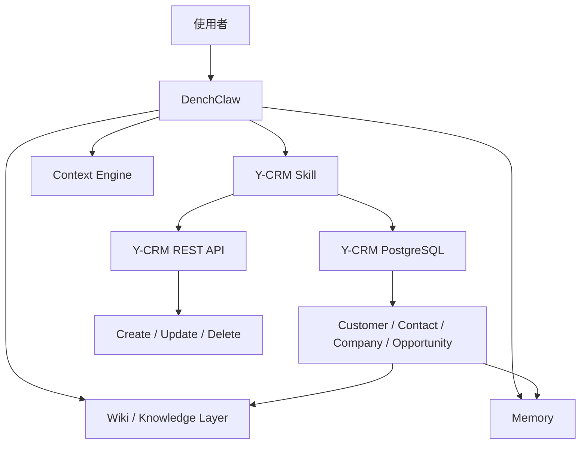

# DenchClaw Y-CRM 新架構對齊與整合進度

> 產生日期：2026-04-16
> 狀態：進行中
> 範圍：先整合既有 Y-CRM 成果，再接下一個系統

## 1. 這份文件的目的

這份文件專門記錄：

- 目前 Y-CRM 在 DenchClaw 中已經完成哪些能力
- 哪些內容其實已存在於 runtime，但尚未正式回收進 repo
- 如何把既有 Y-CRM 成果對齊到新的 DenchClaw 架構
- 下一步應該優先補哪些 Y-CRM 基礎能力

這份文件的角色，是作為 `Y-CRM -> 新架構` 的轉接紀錄。

### 1.1 2026-04-19 補充進度

這一輪新增的重點不是再加一層新 runtime，而是把兩個「容易燒 token、又容易讓 chart 失真」的點收斂進現有架構：

- `單輪 prompt 瘦身`
- `chart guardrail`
- `web-side Rolling Context`

其中 `web-side Rolling Context` 的定位是：

- 放在 `DenchClaw Web / API` 前置層
- 作為 `Hermes-style orchestration` 的補強
- 不取代 `OpenClaw Gateway` 的 session memory
- 不取代 `AI Wiki` 的知識層

它目前分成三種模式：

- `none`
- `window_only`
- `window_plus_summary`

而且只會在「需要承接前文」時才注入，不會把每一輪都塞滿舊歷史。

---

## 2. 目前已知事實

目前 Y-CRM 是 DenchClaw 最先接入、也是完成度最高的外部系統。

已確認存在的能力：

1. **Y-CRM DB Access**
   - PostgreSQL `localhost:5432`
   - 資料庫：`default`
   - 已可透過 DuckDB `postgres_scanner` 唯讀查詢

2. **Y-CRM API Key**
   - 已存在可用 API key
   - 可透過 REST API 進行 create / update / delete

3. **Y-CRM Runtime Skill**
   - 路徑：`~/.openclaw-dench/workspace/skills/ycrm/`
   - 內容比 repo 版 skill 更完整

4. **Y-CRM Reference Files**
   - `feature-guide.md`
   - `db-schema-cheatsheet.md`
   - `analysis-templates.md`
   - `auto-schema-workspace_3joxkr9ofo5hlxjan164egffx.md`

5. **Y-CRM Helper Scripts**
   - `health-check.sh`
   - `workspace-summary.sh`
   - `scan-schema.py`
   - `scan-schema.sh`

---

## 3. 目前發現的 repo / runtime 落差

### Repo 內（較舊）

`/Users/ym/DenchClaw/skills/ycrm/SKILL.md`

特徵：

- 偏英文說明
- 結構較簡單
- 沒有把你後來整理出的「auto-schema 先讀」、「負責業務 FK 查法」、「report-json VALUES 嵌入真實結果」等實戰規則完整收進去
- 缺少 `reference/` 與 `scripts/` 目錄

### Runtime 內（較完整）

`/Users/ym/.openclaw-dench/workspace/skills/ycrm/`

特徵：

- 繁體中文導向
- 已包含實際踩坑後整理出的操作規則
- 已包含 reference 與 scripts
- 已能支撐 Y-CRM 的產品問答、真實查詢、圖表分析、REST 寫入

結論：

> 目前 runtime 版才是實際成熟的 Y-CRM 技能版本，repo 版需要與它對齊。

---

## 4. 這次整合的目標

這一輪只做保守整合，不做大改造。

### 4.1 目標一：把既有成果正式收編進 repo

收編項目：

- `skills/ycrm/SKILL.md`
- `skills/ycrm/reference/*`
- `skills/ycrm/scripts/*`

目的：

- 避免 repo 與 runtime 長期分叉
- 讓未來新架構是在已驗證的 Y-CRM 能力上演進

### 4.2 目標二：把 Y-CRM 放進新架構的語義層

Y-CRM 在新架構中的定位應明確定義為：

- 商業關係中心
- 客戶 / 聯絡人 / 商機的 source-of-truth
- 與 ERP / MES / WMS 對話時的前端商業語義入口

### 4.3 目標三：讓 Y-CRM 成為第一個 AI Wiki / Learning Loop 試點

因為 Y-CRM 已經最成熟，所以最適合先試：

- 客戶摘要頁
- 商機分析頁
- 業務 playbook
- Y-CRM 專屬 memory / SOP

---

## 5. Y-CRM 在新架構中的角色

Y-CRM 在新架構中的責任：

- 提供客戶與關係語義
- 提供商業互動脈絡
- 提供第一批高價值 wiki 素材
- 作為 context engine 的第一個優先輸入來源

---

## 6. 目前應優先保留的 Y-CRM 特殊知識

以下知識必須保留，不應在整合中丟失：

1. **人名查詢規則**
   - 先找 workspaceMember ID
   - 再用 FK 查商機 / 客戶資料

2. **反正規化欄位陷阱**
   - 例如顯示用欄位不可直接拿來篩選

3. **auto-schema 必讀**
   - 查詢前先讀 `auto-schema-workspace_*.md`

4. **report-json 必須用 VALUES 寫入真實結果**
   - 不能在 renderer 端直接假設 postgres_scanner 可用

5. **LINE 是 Y-CRM 的產品差異化核心**
   - 不只是資料表，而是產品能力的一部分

這些都是 Y-CRM 與未來 ERP / MES / WMS 不同的地方，也是最值得保留下來的 domain skill。

---

## 7. 接下來的 Y-CRM 對齊順序

建議順序如下：

1. **收編 runtime skill 到 repo**
2. **補齊 repo 下的 `reference/` 與 `scripts/`**
3. **建立 Y-CRM 專屬 integration profile**
4. **把 Y-CRM canonical objects 與 ontology 對齊**
5. **建立第一批 Y-CRM wiki 頁模板**
6. **再開始做 context builder 的 Y-CRM 路由規則**

在這些做完前，不建議急著展開 ERP / MES / WMS。

### 2026-04-16 當前進度

本輪已完成：

- 將 runtime 版 `Y-CRM` skill 正式同步回 repo
- 將 `reference/` 與 `scripts/` 正式同步回 repo
- 建立 `Y-CRM integration profile` 初版
- 建立第一批 `Y-CRM wiki templates`
- 建立 `Y-CRM context builder spec` 初版
- 建立 `Y-CRM context builder examples` 初版
- 建立 `Y-CRM routing checklist` 初版
- 建立 `Y-CRM context builder prototype contract` 初版
- 建立 `Y-CRM context builder prototype test cases` 初版
- 建立 `Y-CRM context builder prototype scorecard` 初版
- 實作 `apps/web/lib/ycrm-context-builder.ts` 最小純函式骨架
- 建立 `apps/web/lib/ycrm-context-builder.test.ts` 對應測試骨架
- 完成 `ycrm-context-builder.test.ts` 首輪驗證，10 / 10 測試通過
- 建立 `app/api/debug/ycrm-context-builder/route.ts` 內部 debug route
- 建立 `app/api/debug/ycrm-context-builder/route.test.ts` route 測試骨架
- 完成 builder + debug route 測試，合計 15 / 15 測試通過
- 建立 `app/debug/ycrm-context-builder/page.tsx` 輕量 debug page
- 建立 `app/debug/ycrm-context-builder/page.test.tsx` 頁面測試骨架
- 完成 builder + debug route + debug page 測試，合計 17 / 17 測試通過
- 將 Y-CRM builder 接入 `POST /api/chat` 前置流程
- 將 planner preflight 摘要寫入 web session metadata
- 完成 chat preflight 整合測試，`app/api/chat/chat.test.ts` 23 / 23 通過
- 完成 builder + debug route + debug page + chat preflight 全套驗證，合計 41 / 41 測試通過
- 擴充 `GET /api/web-sessions/[id]`，可一併回傳 session metadata 與 `plannerPreflight`
- 擴充 `app/debug/ycrm-context-builder/page.tsx`，可直接用 web session ID 查看最新 planner preflight
- 完成 session metadata + debug page 可見化驗證，`web-sessions + debug page + chat` 合計 41 / 41 測試通過
- 擴充 `app/components/workspace/chat-sessions-sidebar.tsx`，在 session row 顯示 `Y-CRM / Cross-system / workspace` 輕量 badge
- 建立 `app/components/workspace/chat-sessions-sidebar.test.tsx`，驗證 session sidebar 會正確顯示 planner preflight 狀態
- 完成 session sidebar 可見化驗證，`chat-sessions-sidebar + web-sessions + chat` 合計 40 / 40 測試通過
- 擴充 `app/components/chat-panel.tsx`，在 chat panel header 顯示目前 session 的 planner preflight 狀態列
- 將 chat panel 在 session 載入、送出後、完成後同步讀回最新 planner preflight
- 抽出 `app/components/planner-preflight-header.tsx`，將 chat header 狀態列整理成可重用 UI 元件

### 2026-04-18 封板硬化進度（phase-1 hardening）

本輪開始進入「Y-CRM phase-1 封板硬化」模式，重點不是再補新功能，而是把之後要複製到 ERP / MES / WMS / EMS 的基礎做穩。

本輪已完成：

- 強化 `app/api/debug/ycrm-learning-draft/promote/route.ts`
  - `reviewer_actor` 改為必填
  - `review_reason` 改為必填
  - `force promote` 只允許發生在 `promotion_conflicted`
  - 一般 promote 不再接受已衝突或已終結狀態的 draft
- 強化 `app/api/debug/ycrm-learning-draft/resolve/route.ts`
  - `keep current` 只允許發生在 `promotion_conflicted`
  - `reviewer_actor / review_reason` 改為必填
- 擴充 `app/api/web-sessions/shared.ts`
  - 新增 `invalidateSessionPlannerArtifacts()`
  - 非 Y-CRM / 非可持久化 turn 進來時，會清掉過期 `plannerPreflight / plannerContextPack`
  - 若 learning draft 已進入 `promoted / resolution_kept_current` 這類已審核完成狀態，會保留 audit artifact，不直接抹掉
- 擴充 `app/api/chat/route.ts`
  - 當最新 turn 不再適合保留 Y-CRM planner 狀態時，自動觸發 stale metadata invalidation
- 擴充 `app/components/planner-preflight-header.tsx`
  - 在 chat 內頁 header 新增 `Open review` 入口
  - 可直接帶著 `sessionId` 跳到 debug review 頁
- 擴充 `app/debug/ycrm-context-builder/page.tsx`
  - 支援 `?sessionId=...` 自動載入 session snapshot
  - 在 client 端先做 reviewer 欄位檢查，避免使用者按了 promote / resolve 才在 server 才知道缺欄位

本輪聚焦驗證結果：

- `app/api/chat/chat.test.ts`
- `app/api/debug/ycrm-learning-draft/promote/route.test.ts`
- `app/api/debug/ycrm-learning-draft/resolve/route.test.ts`
- `app/debug/ycrm-context-builder/page.test.tsx`
- `app/components/planner-preflight-header.test.tsx`
- `app/api/web-sessions/web-sessions.test.ts`

合計：`62 / 62 pass`

這一輪的意義：

- 把 review / promotion 從「可以做」推進到「server 端有明確規則」
- 把 planner metadata 從「可能殘留舊狀態」推進到「開始有失效控制」
- 把主流程從「只能靠 debug page 手動找 session」推進到「chat 內頁可直接跳 review」

### 2026-04-18 封板硬化進度（phase-1 hardening round 2）

本輪繼續處理「planner preflight 看起來太像真相」的問題，開始把它在型別、persisted metadata、以及 UI 顯示層都明確標示成 `heuristic / advisory`。

本輪已完成：

- 擴充 `SessionPlannerPreflight`
  - 新增 `validationState?: "heuristic" | "validated" | "stale"`
- 擴充 `lib/ycrm-context-builder.ts`
  - 所有新產生的 planner preflight 會明確帶上 `validationState: "heuristic"`
- 擴充 `app/components/planner-preflight-header.tsx`
  - chat header 新增 `Advisory / Validated` 狀態 pill
  - tooltip 也會顯示 planner state
- 擴充 `app/components/workspace/chat-sessions-sidebar.tsx`
  - session queue row 新增 `Advisory / Validated` 狀態 chip
  - planner tooltip 也會顯示 state
- 擴充 `app/debug/ycrm-context-builder/page.tsx`
  - `Latest Session Preflight` 區塊新增 `Planner state`
  - 補上 `Advisory planner state / Validated planner state` 提示

本輪聚焦驗證結果：

- `app/components/planner-preflight-header.test.tsx`
- `app/components/workspace/chat-sessions-sidebar.test.tsx`
- `app/debug/ycrm-context-builder/page.test.tsx`
- `app/api/chat/chat.test.ts`

合計：`39 / 39 pass`

這一輪的意義：

- 把 planner preflight 從「像真相」改成「明確是前置判斷」
- 讓使用者在 chat header、sidebar、debug page 都能看出這是一層 advisory metadata
- 為後面要接 ERP / MES / WMS / EMS 時的 truth / heuristic 邊界先打底

### 2026-04-18 封板硬化進度（phase-1 hardening round 3）

本輪補的是 QA 在總檢查時點名的 coverage 缺口，重點是把 phase-1 最容易在後續多系統時出事的分支補到測試裡。

本輪已完成：

- 新增 `app/api/chat/chat-session-planner.integration.test.ts`
  - 驗證 `POST /api/chat -> planner metadata persistence -> GET /api/web-sessions/[id]`
  - 驗證 Y-CRM turn 之後真的會寫入 `plannerPreflight / plannerContextPack`
  - 驗證後續非 Y-CRM turn 真的會觸發 stale metadata invalidation
- 擴充 `lib/ycrm-learning-promotion.test.ts`
  - 新增 `different_source_session` conflict branch coverage
- 新增 `lib/ycrm-learning-writeback.test.ts`
  - 補 helper-level writeback coverage
  - 驗證 markdown rendering
  - 驗證 existing file skip / overwrite matrix

本輪聚焦驗證結果：

- `app/api/chat/chat-session-planner.integration.test.ts`：`2 / 2 pass`
- `lib/ycrm-learning-promotion.test.ts`：`3 / 3 pass`
- `lib/ycrm-learning-writeback.test.ts`：`2 / 2 pass`

合計：`7 / 7 pass`

這一輪的意義：

- 補上較接近端到端的 planner persistence 驗證
- 補上 `different_source_session` 這個未來跨 session / 跨系統很容易踩到的 conflict 分支
- 補上 writeback helper 的直接測試，讓 promotion / writeback 這條線的信心更完整

### 2026-04-18 封板硬化進度（phase-1 hardening round 4）

本輪開始把 review 入口從 `debug-first` 再往正式產品流程內收。

本輪已完成：

- 新增正式 review 路由：`app/review/ycrm/page.tsx`
  - 目前先重用既有 Y-CRM review 工作區，不重做邏輯
  - 但入口已不再依賴 `/debug/...` 路由命名
- 擴充 `app/components/planner-preflight-header.tsx`
  - chat 內頁 `Open review` 現在會帶到 `/review/ycrm?sessionId=...`
- 擴充 `app/debug/ycrm-context-builder/page.tsx`
  - 同一個 review 工作區會依路由自動切成較正式的 review 模式文案
  - `/review/ycrm` 下會顯示：
    - `Review Queue`
    - `Y-CRM Review Workspace`
    - `Review route ready`

本輪聚焦驗證結果：

- `app/components/planner-preflight-header.test.tsx`
- `app/debug/ycrm-context-builder/page.test.tsx`

合計：`10 / 10 pass`

這一輪的意義：

- 把 review 入口從「只有 debug 頁才找得到」推進到「chat 內頁可直接進正式 review route」
- 降低後續 phase-1 封板時對 debug branding 的依賴

### 2026-04-19 封板硬化進度（phase-1 hardening round 5）

本輪把 review queue 從「看得到狀態」再往前推成「可直接採取動作」。

本輪已完成：

- 擴充 `app/components/workspace/chat-sessions-sidebar.tsx`
  - 對有 review 狀態的 session row 顯示 `Go to review`
  - 直接導向 `/review/ycrm?sessionId=...`
  - 不必先點進 chat 內頁，從 queue 清單就能直接進正式 review workspace

本輪聚焦驗證結果：

- `app/components/workspace/chat-sessions-sidebar.test.tsx`

合計：`6 / 6 pass`

這一輪的意義：

- 把 review queue 從「資訊看板」往「可執行工作流入口」推進
- 讓使用者可以從 sidebar queue 直接處理 draft-ready / needs-review session

### 2026-04-19 封板硬化進度（phase-1 hardening round 6）

本輪開始把 phase-1 從「功能幾乎完成」收斂成「可正式驗收的樣板結論與圖文文件」。

本輪已完成：

- 更新 `docs/DenchClaw_YCRM_實作封板版_系統架構圖與流程圖.md`
  - 將更新日期提升到 `2026-04-19`
  - 架構圖補上正式 `Review Workspace`：`/review/ycrm`
  - 明確區分 `Review Workspace` 與 `Debug Utilities`
  - 流程圖改為反映目前真實的 `Open review / Go to review -> /review/ycrm` 閉環
  - 新增 queue 與正式 review workspace 已形成閉環的說明
- 新增 `docs/DenchClaw_YCRM_Phase1_封板評估與樣板化結論.md`
  - 明確回答 `Y-CRM phase-1` 是否可封板
  - 定義哪些骨架可直接複製到下一個系統
  - 定義哪些部分仍屬下一階段，不應混淆成 phase-1 缺陷
- 更新本文件的 `封板版圖文文件` 區段
  - 將 phase-1 封板評估文件一起納入正式輸出清單

這一輪的意義：

- 不只讓程式可運作，也讓目前的 phase-1 狀態可以被正式驗收與溝通
- 把「Y-CRM 是否已可作為 ERP / MES / WMS / EMS 樣板」這件事寫成可追蹤的結論
- 讓後續系統接入時，有一份不只講理想、而是依現況實作整理的正式基準
- 補上 `confidence / warning / blocker` 狀態 badge，讓 chat 內頁的 routing 狀態更完整
- 建立 `app/components/planner-preflight-header.test.tsx`，驗證 header 狀態列會正確顯示 planner badge
- 建立 `apps/web/lib/ycrm-context-pack.ts`，把 Y-CRM planner plan 整理成可重用的 context pack
- 建立 `apps/web/lib/ycrm-context-pack.test.ts`，驗證 context pack 的封包內容與 prompt block 格式
- 將 `app/api/chat/route.ts` 改為注入 `Y-CRM Context Pack`，不再只塞入簡化 preflight 字串
- 完成 `ycrm-context-builder + ycrm-context-pack + chat` 聚焦驗證，合計 35 / 35 測試通過
- 擴充 `app/api/web-sessions/shared.ts`，將 `plannerContextPack` 一併持久化到 session metadata
- 擴充 `app/debug/ycrm-context-builder/page.tsx`，可直接讀回並顯示 `Latest Session Context Pack`
- 完成 `chat + web-sessions + debug page` 的 session context pack 可見化驗證，合計 41 / 41 測試通過
- 建立 `apps/web/lib/ycrm-learning-draft.ts`，可根據真實 session + planner metadata 產生第一版 learning draft
- 建立 `app/api/debug/ycrm-learning-draft/route.ts`，可用 session snapshot 生成 wiki / playbook / memory 草稿
- 擴充 `app/debug/ycrm-context-builder/page.tsx`，加入 `Generate Learning Draft` 入口與 `Y-CRM Learning Draft` 區塊
- 完成 `learning draft lib + debug route + debug page` 驗證，相關測試全數通過
- 擴充 `app/api/web-sessions/shared.ts`，將 `plannerLearningDraft` 一併持久化到 session metadata
- 擴充 `app/debug/ycrm-context-builder/page.tsx`，可直接顯示 `Latest Session Learning Draft`
- 完成 `learning draft route + web-sessions + debug page` 的 persisted visibility 驗證，合計 24 / 24 測試通過
- 擴充 `apps/web/lib/ycrm-learning-draft.ts`，加入 `minimal_evidence` 模式與 `single_session_single_draft / manual_trigger_only / planner_context_only` token guardrails
- 擴充 `app/api/debug/ycrm-learning-draft/route.ts`，若 session 已有 `plannerLearningDraft` 且未指定 `force_regenerate`，會直接回傳 cache hit
- 建立 `apps/web/lib/ycrm-learning-writeback.ts`，將 approved `wiki` draft 安全寫成 `wiki/...` markdown 草稿檔
- 建立 `app/api/debug/ycrm-learning-draft/writeback/route.ts`，支援把 session 上的 learning draft 寫回 wiki draft files
- 擴充 `app/debug/ycrm-context-builder/page.tsx`，加入 `Write Wiki Draft Files` 入口，並顯示 `Fresh draft / Cache hit / Writeback status / token guardrails`
- 完成 `learning draft cache guardrails + writeback route + debug page` 聚焦驗證，合計 30 / 30 測試通過
- 擴充 `app/debug/ycrm-context-builder/page.tsx`，加入 `Force regenerate learning draft / Overwrite existing wiki draft files` 控制
- 擴充 learning draft debug UI，直接顯示 `writeback files / skipped files / draft source / updated time`
- 建立 `DenchClaw_OpenClawGateway_HermesAgent_AIWiki_實作對照表.md`，把 OpenClaw Gateway、Hermes 模式、AI Wiki 與目前已落地檔案一一對上
- 建立 `apps/web/lib/ycrm-learning-promotion.ts`，將已寫出的 wiki draft files 安全登記進 `wiki/index.md` 與 `wiki/log.md`
- 建立 `app/api/debug/ycrm-learning-draft/promote/route.ts`，支援把 session 上的 wiki 草稿正式 promotion 進 wiki registry
- 擴充 `app/debug/ycrm-context-builder/page.tsx`，加入 `Promote Wiki Draft Files`，並顯示 promoted files 與 registry 更新結果
- 完成 `promotion helper + promotion route + debug page` 聚焦驗證，合計 17 / 17 測試通過
- 擴充 `apps/web/lib/ycrm-learning-promotion.ts`，在 promoted wiki page 本體加入 `Promotion Metadata` 區塊
- 擴充 `apps/web/lib/ycrm-learning-draft.ts`，在 writeback 狀態保存 `approved_at / approved_via`
- 擴充 `app/debug/ycrm-context-builder/page.tsx`，直接顯示 `approved_via / approved_at`
- 完成 `promotion approval metadata` 聚焦驗證，合計 8 / 8 測試通過
- 擴充 `apps/web/lib/ycrm-learning-promotion.ts`，在 promotion 前先檢查頁面是否仍像 generated draft，並辨識跨 session promotion conflict
- 擴充 `apps/web/lib/ycrm-learning-draft.ts`，在 writeback 狀態保存 `promotion_conflict_files`
- 擴充 `app/debug/ycrm-context-builder/page.tsx`，加入更 user-friendly 的 `Promotion safety check` 說明與 `Promotion Conflicts` 區塊
- 完成 `promotion conflict guardrail + friendlier UI` 聚焦驗證，合計 10 / 10 測試通過
- 擴充 `apps/web/lib/ycrm-learning-promotion.ts`，在 conflict 時回傳 `current page vs proposed draft` 的 compare data
- 擴充 `app/debug/ycrm-context-builder/page.tsx`，加入 `Conflict Compare View`，直接顯示目前頁面標題/摘要與本次 draft 想推進的標題/大綱
- 完成 `promotion compare view` 聚焦驗證，合計 10 / 10 測試通過
- 擴充 `app/api/debug/ycrm-learning-draft/promote/route.ts`，支援 `force_conflict_override`
- 建立 `app/api/debug/ycrm-learning-draft/resolve/route.ts`，支援 `Keep Current Page`
- 擴充 `apps/web/lib/ycrm-learning-draft.ts`，保存 `resolution_action / resolved_at`
- 擴充 `app/debug/ycrm-context-builder/page.tsx`，在 compare view 補上 `Keep Current Page / Force Promote This Draft`
- 完成 `promotion resolution actions` 聚焦驗證，合計 12 / 12 測試通過
- 擴充 `apps/web/lib/ycrm-learning-draft.ts`，建立 session-level `history` / audit trail，記錄 `draft_generated / wiki_draft_written / promotion_conflicted / promotion_succeeded / resolution_kept_current`
- 擴充 `app/debug/ycrm-context-builder/page.tsx`，加入較 user-friendly 的 `Learning Timeline`，可直接回看這個 session 的 learning / promotion / resolution 脈絡
- 補上 `ycrm-learning-draft.test.ts + promote/resolve route tests + debug page test` 的 audit trail 驗證
- 完成 `resolution history / audit trail` 聚焦驗證，相關測試通過
- 擴充 `apps/web/lib/ycrm-learning-draft.ts`，在 `promote / force promote / keep current` 保存 `review_reason / reviewer_note`
- 擴充 `app/api/debug/ycrm-learning-draft/promote/route.ts` 與 `resolve/route.ts`，支援傳入人工審核理由與備註
- 擴充 `app/debug/ycrm-context-builder/page.tsx`，加入更好填寫的 `Review reason / Reviewer note`，並在 `Review Context` 與 `Learning Timeline` 顯示
- 完成 `reviewer note / resolution reason` 聚焦驗證，合計 15 / 15 測試通過
- 擴充 `apps/web/lib/ycrm-learning-draft.ts`，在 writeback 與 history 保存 `reviewer_actor`
- 擴充 `app/api/debug/ycrm-learning-draft/promote/route.ts` 與 `resolve/route.ts`，支援傳入 `reviewer_actor`
- 擴充 `app/debug/ycrm-context-builder/page.tsx`，加入 `Reviewer identity` 欄位，並在 `Review Context / Learning Timeline` 顯示
- 完成 `reviewer identity / approval actor` 聚焦驗證，合計 15 / 15 測試通過
- 擴充 `app/debug/ycrm-context-builder/page.tsx`，加入 `Review state` badge，讓 draft / conflict / reviewed 狀態更容易一眼判讀
- 擴充 `app/debug/ycrm-context-builder/page.tsx`，加入 `Show all events / Show reviewed only / Show conflicts only` timeline filter
- 補上 `app/debug/ycrm-context-builder/page.test.tsx`，驗證 review state 與 conflict filter 顯示行為
- 完成 `review state badges / timeline filter` 聚焦驗證，頁面測試 4 / 4 通過
- 擴充 `app/components/workspace/chat-sessions-sidebar.tsx`，在 session row 顯示 `Needs review / Reviewed / Promoted / Draft ready` queue badge
- 擴充 `app/components/workspace/chat-sessions-sidebar.tsx`，在已有 reviewer 時顯示 `by:<reviewer>`，讓 session list 更像 review queue
- 補上 `chat-sessions-sidebar.test.tsx`，驗證 conflict 與 reviewed 狀態在 sidebar 的 badge 顯示
- 完成 `session-level review queue visibility` 聚焦驗證，sidebar 測試 3 / 3 通過
- 擴充 `app/components/workspace/chat-sessions-sidebar.tsx`，在 `DenchClaw` tab 加入 `All / Needs review / Reviewed` review queue filter
- 補上 `chat-sessions-sidebar.test.tsx`，驗證多 session queue filter 切換與顯示內容
- 完成 `session-level review queue filter` 聚焦驗證，sidebar 測試 4 / 4 通過
- 擴充 `app/debug/ycrm-context-builder/page.tsx`，加入 `Reload Session Snapshot`，可直接重新讀回 persisted session metadata
- 擴充 `app/debug/ycrm-context-builder/page.tsx`，在 reload 成功後顯示更 user-friendly 的 persisted-state 提示
- 補上 `page.test.tsx`，驗證 resolution 後重新 reload session snapshot 仍維持 reviewed 狀態
- 完成 `reload persistence` 聚焦驗證，頁面測試 4 / 4 通過
- 擴充 `app/api/web-sessions/web-sessions.test.ts`，補上 `GET /api/web-sessions?includeAll=true` 的真實列表驗證
- 驗證 `plannerLearningDraft.writeback.status / review_reason / reviewer_actor` 會隨 session list payload 一起回傳
- 完成 `web-sessions review queue payload` 聚焦驗證，API 測試 16 / 16 通過
- 擴充 `app/debug/ycrm-context-builder/page.test.tsx`，補上 `Force Promote This Draft` 的完整 UI 路徑驗證
- 驗證 conflict -> force promote -> reload session snapshot 後，`promoted / manual_force_promotion` 狀態仍可從 persisted metadata 正常讀回
- 完成 `force promote UI path` 聚焦驗證，頁面測試 5 / 5 通過
- 擴充 `app/debug/ycrm-context-builder/page.tsx`，加入更清楚的 review guidance 卡片
- 讓 `written / promotion_conflicted / resolution_kept_current / promoted` 狀態都有更易懂的說明，不只剩 status chip
- 完成 user-friendly review guidance 驗證，頁面測試 5 / 5 維持通過
- 擴充 `app/components/workspace/chat-sessions-sidebar.tsx`，把 `Draft ready` 從 All 清單裡獨立成 review queue filter
- 讓 sidebar 的空狀態提示會依 `Draft ready / Needs review / Reviewed` 自動換成更易懂的說明
- 完成 `session-level review queue workflow` 聚焦驗證，sidebar 測試 5 / 5 通過
- 擴充 `app/components/workspace/chat-sessions-sidebar.tsx`，在 DenchClaw sidebar 加入 `Review Queue` summary 條
- 讓使用者不切 filter 也能先看到 `Draft ready / Needs review / Reviewed` 的總覽與目前最該處理的階段
- 完成 `review queue summary` 聚焦驗證，sidebar 測試 6 / 6 通過
- 擴充 `app/components/planner-preflight-header.tsx`，讓 chat 內頁 header 也能顯示 `Draft ready / Needs review / Reviewed / Promoted / by:<reviewer>`
- 擴充 `app/components/chat-panel.tsx`，在 session reload / refresh 時一併帶回 `plannerLearningDraft`
- 完成 `chat header review continuity` 聚焦驗證，planner header 測試 3 / 3 通過
- 擴充 `app/components/planner-preflight-header.tsx`，在 chat header 補上更明確的 `Next:` 狀態說明
- 讓 `Needs review / Promoted` 等狀態不只顯示 badge，也直接告訴使用者下一步或目前已完成什麼
- 完成 `chat header next-action hint` 聚焦驗證，planner header 測試 3 / 3 維持通過

這代表 Y-CRM 已從「只有 runtime 有完整知識」進一步變成「repo 與 runtime 都有可追蹤基礎」。

---

## 8. 這一輪完成後，Y-CRM 才算「正式進入新架構」

當以下條件成立時，可視為 Y-CRM 已完成第一階段對齊：

- repo 與 runtime skill 不再分叉
- Y-CRM reference / scripts 都在 repo 裡可追蹤
- Y-CRM 的資料主權角色已在 `source-of-truth.md` 中固定
- Y-CRM 已被視為新的 canonical architecture 的第一個正式 adapter/skill domain
- 後續 wiki / memory / playbook 都能以 Y-CRM 為第一個試點系統

---

## 9. 其他系統的時機

在 Y-CRM 第一階段對齊完成後，建議順序仍是：

1. ERP
2. MES
3. WMS
4. EMS（新補充系統，先保留在架構規劃層，等定義更清楚再落地）

目前對 EMS 的處理策略：

- 先放入總架構文件的未來系統範圍
- 暫不急著定義 canonical object
- 等 Y-CRM 對齊穩定後，再根據 EMS 真正的業務內容補 ontology

---

## 10. 封板版圖文文件

目前這一階段已另外整理成一份「依實作現況繪製」的正式文件：

- `docs/DenchClaw_YCRM_實作封板版_系統架構圖與流程圖.md`
- `docs/DenchClaw_YCRM_Phase1_封板評估與樣板化結論.md`
- `docs/DenchClaw_YCRM_Phase1_總驗收檢查清單.md`
- `docs/DenchClaw_OpenClawGateway_HermesAgent_AIWiki_最終版架構圖與演進路線.md`

這份文件包含：

- 一張目前版本的系統架構圖
- 一張目前版本的實作流程圖
- 目前已落地的主要檔案對照
- 下一階段本地模型與多系統擴張怎麼接上
- phase-1 是否可封板、哪些骨架可複製到下一個系統、哪些部分仍屬下一階段
- phase-1 總驗收時應實際點哪些 UI / API / 文件
- `OpenClaw Gateway + Hermes-style orchestration + AI Wiki` 的目前版與未來本地模型版最終架構圖
