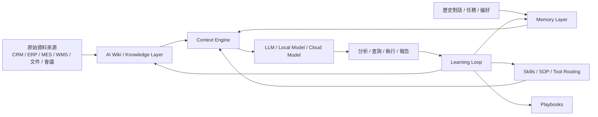
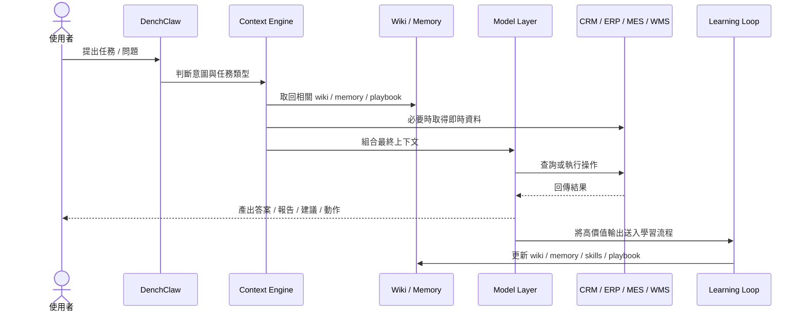
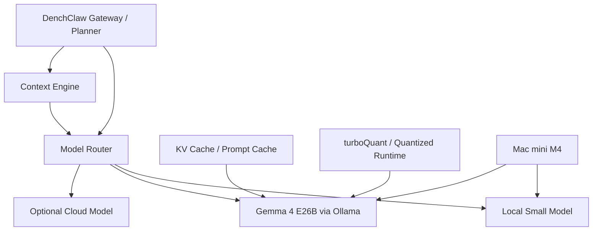

# DenchClaw 企業內部 AI 產品化與本地模型化路線圖

> 產生日期：2026-04-16
> 狀態：規劃版 v1

## 1. 這份文件的目的

這份文件專門補充說明：

- DenchClaw 未來如何從「可用的 AI 工具」演進成「真正的公司內部 AI 產品」
- AI Wiki、Hermes Agent 式能力、自我學習能力，如何在 DenchClaw 中形成完整閉環
- 未來如何接上本地模型堆疊，例如 Ollama、Gemma 4 E26B、量化與 KV Cache
- 從現在到未來的分階段落地流程

這份文件與下列主架構文件互補：

- `/Users/ym/DenchClaw/docs/DenchClaw_ERP_YCRM_MES_WMS_融合架構設計.md`

主架構文件重點在「系統分層與跨系統設計」，本文件重點在「產品化、智能化、本地模型化的演進路徑」。

---

## 1.1 實作進度紀錄

### 2026-04-16

已完成第一個基礎切片：

- 新增 `schema/ontology.md`
- 新增 `schema/source-of-truth.md`
- 新增 `wiki/index.md`
- 新增 `wiki/log.md`
- 重新讀取既有 Y-CRM runtime skill、reference、scripts、架構圖、踩坑紀錄
- 確認目前 runtime 版 Y-CRM 能力比 repo 版完整
- 新增 `Y-CRM 新架構對齊與整合進度` 文件
- `EMS` 已加入未來系統規劃範圍（暫不急著展開 object 設計）

這一步的目的不是一次把內容寫滿，而是先把 DenchClaw 未來最重要的兩個基礎規格固定下來：

- **Ontology**：先穩定跨系統的企業語義
- **Source of Truth**：先穩定跨系統的資料主權

後續順序將維持保守推進：

1. `schema/ontology.md`
2. `schema/source-of-truth.md`
3. `wiki/index.md`
4. `wiki/log.md`
5. Y-CRM 對齊與 repo 收編
6. context builder 初版
7. learning loop 初版

---

## 2. 最終目標

你未來真正想要的，不只是：

- 一個能聊天的 AI
- 一個能查 CRM / ERP / MES / WMS 的工具

而是：

> 一個理解公司知識、理解公司流程、能跨系統工作、會持續累積經驗、且可在公司內部本地運行的 AI Operating Product。

也就是說，DenchClaw 最終應該具備五種能力：

1. **跨系統理解能力**
2. **企業知識累積能力**
3. **工作流程編排能力**
4. **可控的自我學習能力**
5. **本地部署與資料內部化能力**

---

## 3. 為什麼「接本地模型」不是第一步

很多團隊一開始會以為：

> 只要把本地模型裝好，AI 就會變成公司內部產品。

其實不是。

如果沒有以下這些基礎層，就算你接上再大的本地模型，也只會變成：

- 更會說話
- 更像懂
- 但其實不穩
- 更容易一本正經地誤判
- 還是不知道公司的真實流程與資料責任

真正決定 DenchClaw 能不能變成企業內部 AI 產品的，是這四層：

1. **Ontology**
2. **Wiki / Knowledge Layer**
3. **Context Engine**
4. **Learning Loop**

模型只是推理引擎，不是企業智慧本身。

---

## 4. 你要的「真正變聰明」是什麼

未來 DenchClaw 的「變聰明」應定義成下面四類，而不是單指模型參數更大：

### A. 更懂公司資料

它知道：

- 客戶是誰
- 訂單在哪
- 生產做到哪
- 倉庫貨在哪
- 各系統誰才是資料主權

### B. 更懂公司流程

它知道：

- 訂單延誤通常怎麼追
- 客訴追溯通常要看哪些系統
- 生產異常與出貨異常如何拆解
- 哪些事情能自動做，哪些事情必須確認

### C. 更懂使用者習慣

它知道：

- 你慣用哪些術語
- 你喜歡哪種報表格式
- 你喜歡先看摘要還是先看原始資料
- 哪些專案或客戶是你特別常追蹤的

### D. 更懂過去經驗

它會記住：

- 曾經成功的處理方式
- 曾經失敗的方式
- 哪些查詢 pattern 有效
- 哪些流程已經可抽象成 playbook

這四種能力一起成立，DenchClaw 才算真的變聰明。

---

## 5. AI Wiki、Hermes Agent、自我學習在 DenchClaw 中的角色

### AI Wiki 提供什麼

AI Wiki 提供的是「可累積的知識層」：

- raw sources
- wiki pages
- schema / conventions
- ingest / query / lint

它解決的是：

- 知識無法累積
- 每次都要從零檢索
- 長期分析結果消失在 chat 裡

### Hermes Agent 式能力提供什麼

Hermes 類型架構最值得借的是：

- session memory
- context engine
- subagents
- cron
- learning loop

它解決的是：

- 多回合上下文不穩
- 長任務不好拆
- 歷史經驗無法重用
- agent 不知道什麼時候該學、學什麼

### 自我學習能力提供什麼

自我學習在 DenchClaw 中，不是模型自己重訓，而是：

- 記住使用者偏好
- 把成功流程固化成 playbook
- 把高價值結果寫進 wiki
- 把重複模式整理回 skills

這種學習才適合企業環境。

---

## 6. DenchClaw 未來的完整產品閉環

未來真正成熟的 DenchClaw，應該形成以下閉環：

這個閉環的重要性在於：

- 問題不只被回答
- 回答不只停留在 chat
- 有價值的結果會沉澱
- 系統下次會更懂

---

## 7. 本地模型化後，DenchClaw 會多什麼價值

當前如果主要依賴雲端模型，DenchClaw 能先建立架構與能力；之後若切到本地模型，額外價值會出現在以下幾點：

### A. 資料內部化

敏感資料不必離開公司網路或裝置環境。

適合處理：

- 客戶名單
- 訂單資料
- 成本資料
- 工單異常
- 庫存與批號

### B. 成本可控

高頻內部工作流如果全走雲端模型，成本會持續累積；本地模型可以把高頻低風險任務內部化。

### C. 延遲可控

本地任務若模型與 context 都已優化，可在內網完成，不必受外部 API 波動影響。

### D. 可做模型分工

本地模型很適合承接：

- 分類
- 摘要
- wiki ingest
- lint
- SOP 生成
- 固定格式報表整理

而複雜策略分析可保留雲端模型或混合模式。

---

## 8. 未來的模型分工建議

我不建議未來只押單一模型。比較好的方式是多模型分層：

| 層級 | 模型用途 | 建議角色 |
|------|----------|----------|
| 小模型 | 快速分類 / rewrite / 摘要 / 路由 | 意圖辨識、context preprocessing、wiki lint |
| 中模型 | 日常業務問答 / 跨系統分析 | 大部分 CRM/ERP/MES/WMS 查詢任務 |
| 大模型 | 複雜推理 / 根因分析 / 高價值報告 | 長鏈條分析、決策輔助、策略整理 |

如果未來你用 Ollama + Gemma 4 E26B，本地分工可以考慮：

- `小模型`
  - 問題分類
  - query rewrite
  - metadata 抽取
  - wiki ingest 初稿

- `Gemma 4 E26B`
  - 跨系統查詢整理
  - SOP 推導
  - 根因分析
  - 內部報告生成

- `雲端模型`
  - 只保留給最複雜、最長鏈條、最少量的高價值任務

---

## 9. 你提到的本地堆疊，應該怎麼放進 DenchClaw

你提到的方向是：

- Ollama
- Gemma 4 E26B
- turboQuant
- KV Cache reuse
- Mac mini M4

這條路我建議放在 DenchClaw 的 **Model Runtime Layer**，而不是直接混進 knowledge layer。

### 這裡每個元件的角色

#### Ollama

扮演本地模型 runtime：

- 模型管理
- 啟動與載入
- 服務化 API
- 方便被 DenchClaw router 呼叫

#### Gemma 4 E26B

扮演主要本地推理模型：

- 中高複雜度推理
- 跨系統分析
- 內部報告生成
- SOP 與異常分析

#### turboQuant

扮演本地化部署優化層：

- 降低推理資源消耗
- 提高在 Mac mini M4 上的可行性
- 幫助把較大模型壓到可接受的成本與延遲

#### KV Cache reuse

扮演上下文成本優化器：

- 重複任務不必每次重新計算整段上下文
- 對固定模板、固定 wiki 頁、固定系統上下文特別有價值

#### Mac mini M4

扮演本地推理主機：

- 提供內部部署節點
- 適合內部常駐 agent / schedule jobs / wiki maintenance jobs

---

## 10. 最推薦的演進順序

### Stage 0：現在

先把架構打底：

- ontology
- source-of-truth
- skills
- adapters
- wiki
- context engine
- learning loop

### Stage 1：雲端主模型 + 本地架構完成

此時重點不是本地模型，而是讓 DenchClaw 已經具備：

- 跨系統理解
- 可累積知識
- 可審計寫入
- 可拆分任務

### Stage 2：混合模型模式

開始引入本地模型：

- 小任務交給本地小模型
- 中任務交給本地主模型
- 複雜任務保留雲端

這是最穩的過渡期。

### Stage 3：本地模型成為主力

當下列條件成熟後，本地模型可以成為主力：

- context engine 已穩
- ontology 已完整
- wiki 已有一定厚度
- 常用工作流已 playbook 化
- 模型 routing 已能自動選擇

### Stage 4：真正的公司內部 AI 產品

這時 DenchClaw 已不只是工程師用工具，而是可面向團隊或部門：

- 業務
- 內勤
- 採購
- 生管
- 倉管
- 高階管理者

都能用不同介面與權限層來使用它。

---

## 11. 本地模型化後的實際工作流長什麼樣

### 情境一：每日營運摘要

每天早上自動執行：

1. 從 Y-CRM 抓高風險客戶與大商機
2. 從 ERP 抓逾期訂單、缺料、應收異常
3. 從 MES 抓延誤工單、良率異常
4. 從 WMS 抓低庫存、出貨異常、批號風險
5. 交給本地模型彙整成營運摘要
6. 寫入 wiki 與 dashboard

### 情境二：交期異常助手

當使用者問：

「這張單為什麼還沒交？」

流程可能是：

1. 小模型先做任務分類
2. Context engine 抓對 wiki / memory / order context
3. Gemma 4 E26B 做跨 ERP + MES + WMS 的整合推理
4. 若風險高，要求人工確認後執行下一步
5. 最終分析結果寫回 wiki 的延誤案例頁

### 情境三：客訴根因分析

1. 從 CRM 找客訴內容與客戶背景
2. 從 WMS 找出貨批號
3. 從 MES 找對應工單與異常站點
4. 從 ERP 找退貨 / 補貨 / 成本
5. 由本地模型整理成根因分析與建議處置
6. 形成新 playbook 草稿

---

## 12. 為什麼這樣才算企業內部產品

真正的企業內部 AI 產品，不是因為它本地跑，就叫企業產品。

而是因為它同時具備：

### 1. 資料治理

- source-of-truth 明確
- 權限明確
- audit 明確

### 2. 流程治理

- 高風險寫入有確認機制
- 任務可追蹤
- 結果可追溯

### 3. 知識治理

- wiki 有結構
- schema 有規範
- 內容可 lint

### 4. 模型治理

- 不同任務走不同模型
- 本地與雲端可切換
- 模型輸出可被驗證與約束

### 5. 持續進化

- 會學
- 但不是亂學
- 會積累
- 但不是亂堆資料

---

## 13. 我對你這條路的判斷

你的方向是對的，而且這其實是很有產品感的願景：

> 先把 DenchClaw 的知識層與流程層做穩，再把模型層本地化，最後變成企業內部可持續演進的 AI 產品。

這樣的好處是：

- 不是玩模型，而是在做產品
- 不是追熱點，而是在建立公司自己的 AI 基礎設施
- 不是做一次性 demo，而是在做可演進的內部作業平台

---

## 14. 建議下一步

如果要往這個方向落地，我建議下一步按這個順序做：

1. 完成 `ontology.md`
2. 完成 `source-of-truth.md`
3. 建立 `wiki/` 骨架
4. 建立 `erp` / `mes` / `wms` skill 模板
5. 做第一版 `context builder`
6. 做第一版 `learning loop`
7. 之後再加入本地模型 router
8. 最後再接 Ollama + Gemma 4 E26B + cache / quant

也就是：

> **先把 DenchClaw 變成有腦的系統，再把模型搬到本地。**

這樣你未來接上本地模型時，得到的不是一個「本地聊天工具」，而是一個真正的「公司內部 AI 產品」。
