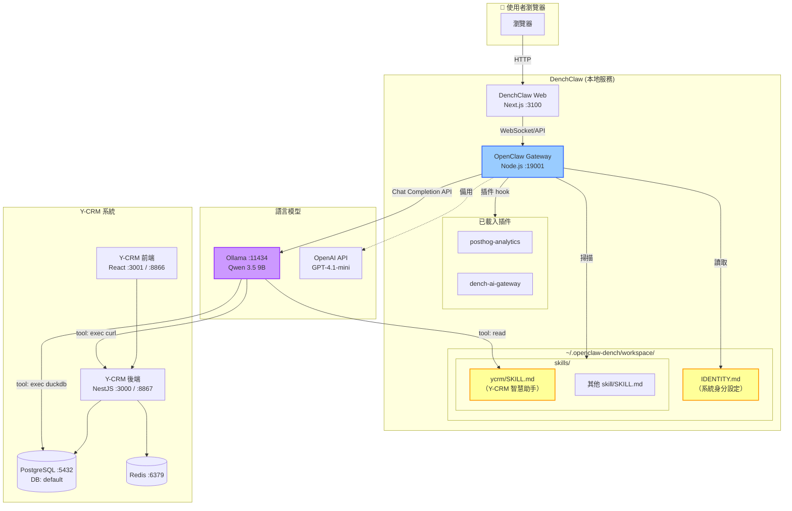
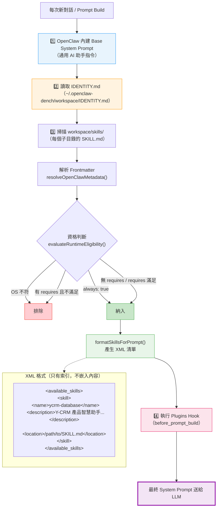
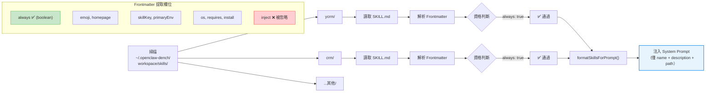
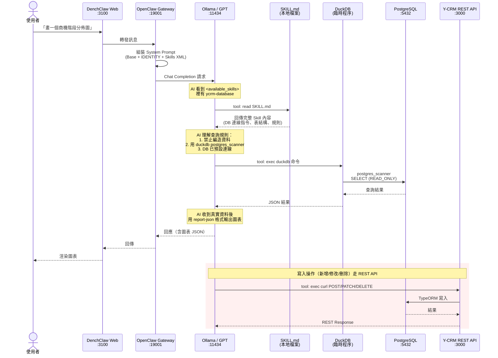
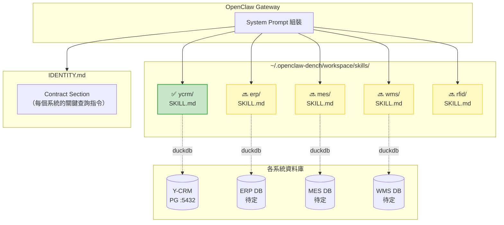

# DenchClaw ↔ OpenClaw ↔ Y-CRM Skill 架構流程圖

> 產生日期：2026-04-09

## 1. 整體服務架構



## 2. System Prompt 組裝流程



## 3. Skill 載入詳細邏輯



## 4. AI 執行 Y-CRM 查詢流程



## 5. 服務連線總覽

```
┌─────────────────────────────────────────────────────────────┐
│                    使用者電腦 (localhost)                       │
│                                                             │
│  ┌──────────────┐     ┌──────────────────┐                  │
│  │ DenchClaw Web│────▶│ OpenClaw Gateway  │                  │
│  │   :3100      │     │   :19001          │                  │
│  └──────────────┘     └────────┬─────────┘                  │
│                                │                             │
│                    ┌───────────┼───────────┐                 │
│                    ▼           ▼           ▼                 │
│            ┌──────────┐ ┌──────────┐ ┌──────────┐           │
│            │ Ollama   │ │ IDENTITY │ │ Skills   │           │
│            │ :11434   │ │ .md      │ │ (SKILL   │           │
│            │ Qwen 3.5 │ │          │ │  .md)    │           │
│            └────┬─────┘ └──────────┘ └──────────┘           │
│                 │                                            │
│      ┌──────────┼──────────────────────────┐                 │
│      │          │     AI Tool 呼叫          │                 │
│      │   ┌──────▼──────┐  ┌──────────────┐ │                 │
│      │   │ DuckDB      │  │ curl         │ │                 │
│      │   │ (postgres_  │  │ (REST API)   │ │                 │
│      │   │  scanner)   │  │              │ │                 │
│      │   └──────┬──────┘  └──────┬───────┘ │                 │
│      └──────────┼────────────────┼─────────┘                 │
│                 │                │                            │
│                 ▼                ▼                            │
│  ┌────────────────────────────────────────────┐              │
│  │           Y-CRM 系統                        │              │
│  │  ┌────────────┐  ┌────────────┐            │              │
│  │  │ PostgreSQL │  │ NestJS API │            │              │
│  │  │ :5432      │  │ :3000      │            │              │
│  │  │ DB:default │  │ (REST+GQL) │            │              │
│  │  └────────────┘  └────────────┘            │              │
│  │  ┌────────────┐  ┌────────────┐            │              │
│  │  │ Redis      │  │ React 前端  │            │              │
│  │  │ :6379      │  │ :3001      │            │              │
│  │  └────────────┘  └────────────┘            │              │
│  └────────────────────────────────────────────┘              │
│                                                              │
│  ┌────────────────────────────────────────────┐              │
│  │  ⚠️ 關鍵限制                                │              │
│  │  • 所有服務都在 localhost，無外部連線          │              │
│  │  • DuckDB 用 READ_ONLY 連 PG（不可寫入）     │              │
│  │  • 寫入只能透過 REST API（curl）              │              │
│  │  • SKILL.md 不嵌入 prompt，AI 需主動 read    │              │
│  └────────────────────────────────────────────┘              │
└──────────────────────────────────────────────────────────────┘
```

## 6. 未來整合新系統的擴展點



### 新增系統 Skill 步驟

1. 建立 `~/.openclaw-dench/workspace/skills/<name>/SKILL.md`（frontmatter 設 `always: true`）
2. 把**最關鍵的查詢指令**寫在 `IDENTITY.md` 的 contract section
3. `SKILL.md` 放補充資訊（表結構、範例 SQL、操作指南）
4. 加強制規則：「禁止編造資料」「DB 已預設連線」
5. **開新對話測試**（skill 只在新對話載入）
6. 小模型不穩定 → 切換更強模型（GPT-4.1-mini / Claude Sonnet）
