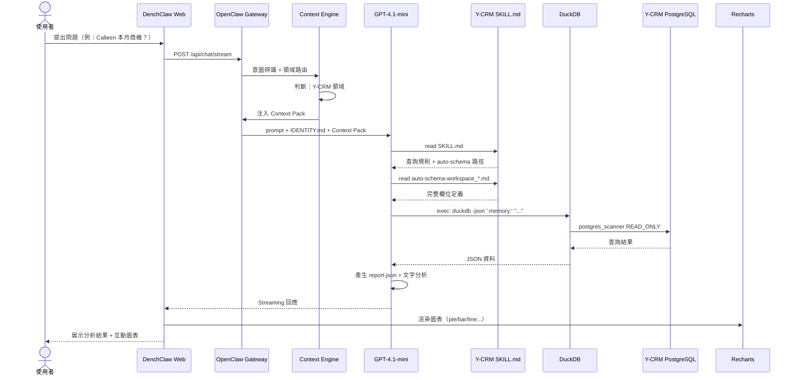
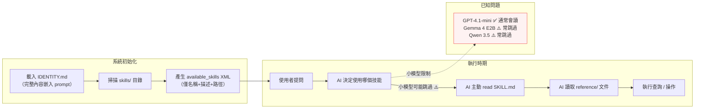

# DenchClaw 目前架構（Current Architecture）

> 產生日期：2026-04-17
> 版本：v2.5.8
> AI Models：Cloud API Key（OpenAI + Dench Cloud）+ Local Fallback（Ollama）

---

## 總覽架構圖

```mermaid
graph TB
    %% ===== Layer 1: Experience Layer =====
    subgraph L1["Layer 1 · Experience Layer（使用者互動層）"]
        Browser["🌐 瀏覽器"]
        WebUI["DenchClaw Web UI<br/>Next.js 15 · React 19<br/>Port 3100"]
        Chat["Chat Panel<br/>Streaming AI 對話"]
        Workspace["Workspace<br/>資料表 · 編輯器 · 檔案樹"]
        Dashboard["Dashboard<br/>報表 · 圖表 · 摘要"]
        SkillStore["Skill Store<br/>技能探索與安裝"]
        Terminal["Terminal<br/>xterm 嵌入式終端"]
    end

    Browser --> WebUI
    WebUI --> Chat
    WebUI --> Workspace
    WebUI --> Dashboard
    WebUI --> SkillStore
    WebUI --> Terminal

    %% ===== Layer 2: Agent Runtime Layer (Hermes Pattern) =====
    subgraph L2["Layer 2 · Agent Runtime Layer（Hermes Agent 模式）"]
        Gateway["OpenClaw Gateway<br/>Port 19001 · WebSocket · JSON-RPC"]
        Planner["Planner / Orchestrator<br/>多步驟規劃 · 任務拆解"]
        Subagents["Subagents<br/>平行子代理執行"]
        Cron["Cron / 排程任務<br/>定時查詢 · 摘要"]
        Session["Session Memory<br/>多回合對話歷史"]
        Tools["工具層"]
        ToolExec["exec<br/>Shell · DuckDB"]
        ToolRead["read<br/>檔案讀取"]
        ToolWeb["web<br/>HTTP · 搜尋"]
    end

    Chat -->|"WebSocket + HTTP"| Gateway
    Gateway --> Planner
    Planner --> Subagents
    Gateway --> Cron
    Gateway --> Session
    Gateway --> Tools
    Tools --> ToolExec
    Tools --> ToolRead
    Tools --> ToolWeb

    %% ===== AI Model Layer =====
    subgraph Models["AI Model Layer（雲端 API Key）"]
        AIGateway["dench-ai-gateway Plugin<br/>模型路由 · 成本計算"]
        OpenAI["☁️ OpenAI<br/>GPT-4.1-mini<br/>（主要模型）"]
        DenchCloud["☁️ Dench Cloud<br/>gateway.merseoriginals.com<br/>（代理路由）"]
        Ollama["🖥️ Ollama Local<br/>gemma4:e2b · 9B params<br/>（備援模型）"]
    end

    Gateway --> AIGateway
    AIGateway --> OpenAI
    AIGateway --> DenchCloud
    AIGateway --> Ollama

    %% ===== Layer 3: Context & Memory Layer =====
    subgraph L3["Layer 3 · Context & Memory Layer（上下文與記憶層）"]
        ContextEngine["Context Engine<br/>ycrm-context-builder.ts<br/>意圖辨識 · 領域路由 · 上下文組裝"]
        ContextPack["Context Pack<br/>結構化 prompt 區塊"]
        Memory["Memory Layer<br/>使用者偏好 · 對話摘要 · 失敗經驗"]
    end

    Gateway --> ContextEngine
    ContextEngine --> ContextPack
    ContextEngine --> Memory
    ContextPack -->|"注入 prompt"| Gateway

    %% ===== Skill System =====
    subgraph Skills["Skill System（技能系統）"]
        Identity["IDENTITY.md<br/>系統契約 · 語言規則<br/>（直接嵌入 prompt ✅）"]
        SkillFiles["SKILL.md 檔案<br/>（AI 需主動 read 📖）"]
        YCRM_Skill["ycrm<br/>Y-CRM 產品專家"]
        CRM_Skill["crm<br/>CRM 操作 · 6 子技能"]
        Composio_Skill["composio-apps<br/>1000+ 第三方整合"]
        AppBuilder_Skill["app-builder<br/>應用建構 · 4 子技能"]
        GStack_Skill["gstack<br/>工程工作流 · 18 角色"]
    end

    Gateway --> Identity
    Gateway --> SkillFiles
    SkillFiles --> YCRM_Skill
    SkillFiles --> CRM_Skill
    SkillFiles --> Composio_Skill
    SkillFiles --> AppBuilder_Skill
    SkillFiles --> GStack_Skill

    %% ===== Layer 4: Knowledge Layer (Karpathy AI Wiki Pattern) =====
    subgraph L4["Layer 4 · Canonical Knowledge Layer（Karpathy AI Wiki 模式）"]
        WikiIndex["wiki/<br/>index.md · log.md"]
        WikiEntities["wiki/entities/<br/>客戶 · 公司 · 產品 · 機台"]
        WikiOps["wiki/operations/<br/>訂單履行 · 採購 · 生產 · 倉儲"]
        WikiPlaybooks["wiki/playbooks/<br/>SOP · 分析模板"]
        SchemaOntology["schema/ontology.md<br/>跨系統企業語義"]
        SchemaSOT["schema/source-of-truth.md<br/>資料主權規則"]
    end

    ContextEngine --> WikiIndex
    ContextEngine --> SchemaOntology
    Memory --> WikiIndex

    %% ===== Layer 5: Adapter & Integration Layer =====
    subgraph L5["Layer 5 · Adapter & Integration Layer（外部系統接入層）"]
        DuckDB["DuckDB Bridge<br/>:memory: · READ_ONLY<br/>postgres_scanner"]
        YCRM_REST["Y-CRM REST API<br/>localhost:8867/rest/*"]
        YCRM_GQL["Y-CRM GraphQL<br/>localhost:3000/graphql"]
        AutoSchema["auto-schema<br/>reference files<br/>9 個工作區欄位定義"]
        ReportJSON["report-json<br/>圖表定義格式<br/>8 種圖表 via Recharts"]
    end

    ToolExec --> DuckDB
    ToolWeb --> YCRM_REST
    ToolWeb --> YCRM_GQL
    ToolRead --> AutoSchema
    Dashboard --> ReportJSON

    %% ===== Layer 6: System of Record =====
    subgraph L6["Layer 6 · System of Record（真實資料層）"]
        YCRM_DB[("Y-CRM PostgreSQL<br/>localhost:5432<br/>9 個工作區 · 16+ 資料表")]
        ERP_Planned["ERP<br/>🔜 規劃中"]
        MES_Planned["MES<br/>🔜 規劃中"]
        WMS_Planned["WMS<br/>🔜 規劃中"]
        EMS_Planned["EMS<br/>🔜 規劃中"]
    end

    DuckDB -->|"postgres_scanner<br/>READ_ONLY"| YCRM_DB
    YCRM_REST --> YCRM_DB
    YCRM_GQL --> YCRM_DB

    %% ===== Learning Loop =====
    subgraph LL["Learning Loop（學習迴路）"]
        AutoDraft["auto-draft<br/>高價值輸出辨識"]
        HumanApprove["human approve<br/>人工審核"]
        WriteBack["write back<br/>沉澱回知識層"]
    end

    Gateway -->|"高價值輸出"| AutoDraft
    AutoDraft --> HumanApprove
    HumanApprove --> WriteBack
    WriteBack --> WikiIndex
    WriteBack --> Memory
    WriteBack --> SkillFiles
    WriteBack --> WikiPlaybooks

    %% ===== Plugin System =====
    subgraph Plugins["Plugin System"]
        P_AIGateway["dench-ai-gateway<br/>模型選擇與路由"]
        P_PostHog["posthog-analytics<br/>行為追蹤"]
        P_Memory["memory-core<br/>對話記憶"]
    end

    Gateway --> P_AIGateway
    Gateway --> P_PostHog
    Gateway --> P_Memory

    %% ===== Styling =====
    classDef layer1 fill:#dbeafe,stroke:#3b82f6,stroke-width:2px
    classDef layer2 fill:#fef3c7,stroke:#f59e0b,stroke-width:2px
    classDef layer3 fill:#d1fae5,stroke:#10b981,stroke-width:2px
    classDef layer4 fill:#ede9fe,stroke:#8b5cf6,stroke-width:2px
    classDef layer5 fill:#fce7f3,stroke:#ec4899,stroke-width:2px
    classDef layer6 fill:#f3f4f6,stroke:#6b7280,stroke-width:2px
    classDef cloud fill:#fff7ed,stroke:#f97316,stroke-width:2px
    classDef learning fill:#ecfdf5,stroke:#059669,stroke-width:2px

    class Browser,WebUI,Chat,Workspace,Dashboard,SkillStore,Terminal layer1
    class Gateway,Planner,Subagents,Cron,Session,Tools,ToolExec,ToolRead,ToolWeb layer2
    class ContextEngine,ContextPack,Memory layer3
    class WikiIndex,WikiEntities,WikiOps,WikiPlaybooks,SchemaOntology,SchemaSOT layer4
    class DuckDB,YCRM_REST,YCRM_GQL,AutoSchema,ReportJSON layer5
    class YCRM_DB,ERP_Planned,MES_Planned,WMS_Planned,EMS_Planned layer6
    class OpenAI,DenchCloud,Ollama,AIGateway cloud
    class AutoDraft,HumanApprove,WriteBack learning
```

---

## 資料查詢流程

---

## 技能載入機制

---

## 元件清單

| 層級 | 元件 | 技術 | 狀態 |
|------|------|------|------|
| L1 Experience | Web UI | Next.js 15 · React 19 · Tailwind 4 | ✅ |
| L1 Experience | Chat Panel | Vercel AI SDK 6 · WebSocket | ✅ |
| L1 Experience | Charts | Recharts 3.7 · report-json | ✅ |
| L1 Experience | Rich Editor | Tiptap 3 · Monaco Editor | ✅ |
| L2 Agent | Gateway | OpenClaw · Port 19001 | ✅ |
| L2 Agent | Planner | Multi-step task orchestration | ✅ |
| L2 Agent | Subagents | Parallel worker spawning | ✅ |
| L2 Agent | Cron | Scheduled jobs | ✅ |
| L3 Context | Context Engine | ycrm-context-builder.ts · 41 tests | ✅ |
| L3 Context | Memory | Session history · preferences | ✅ |
| L4 Knowledge | Wiki | index.md · log.md · entities/ | ✅ 骨架 |
| L4 Knowledge | Ontology | schema/ontology.md | ✅ 初版 |
| L4 Knowledge | Source of Truth | schema/source-of-truth.md | ✅ 初版 |
| L5 Adapter | Y-CRM | DuckDB + REST + GraphQL | ✅ 生產中 |
| L5 Adapter | ERP / MES / WMS / EMS | 尚未接入 | 🔜 規劃中 |
| L6 Data | Y-CRM PostgreSQL | 9 workspaces · 16+ tables | ✅ |
| Models | OpenAI GPT-4.1-mini | Cloud API Key | ✅ 主要 |
| Models | Dench Cloud | Proxy Gateway | ✅ |
| Models | Ollama gemma4:e2b | Local 9B | ✅ 備援 |
| Plugins | dench-ai-gateway | Model routing | ✅ |
| Plugins | posthog-analytics | Telemetry | ✅ |
| Plugins | memory-core | Session memory | ✅ |
