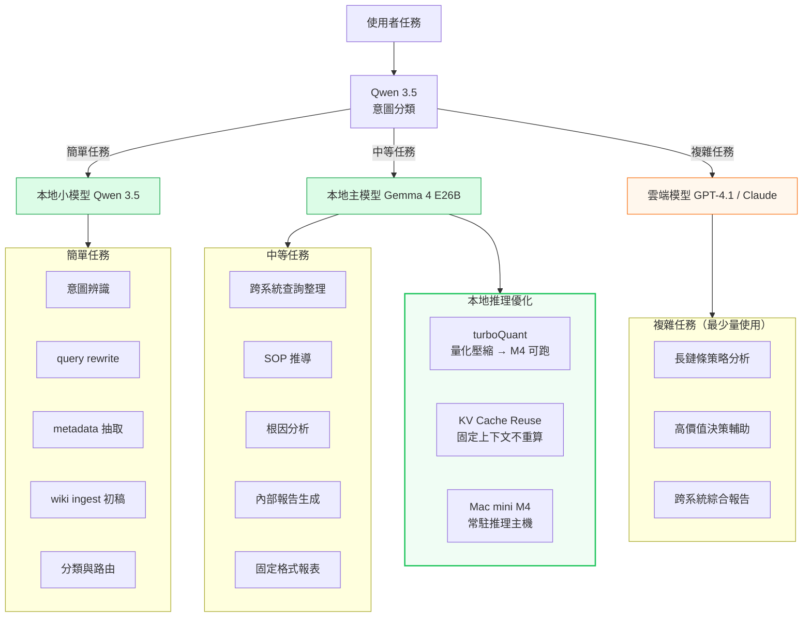
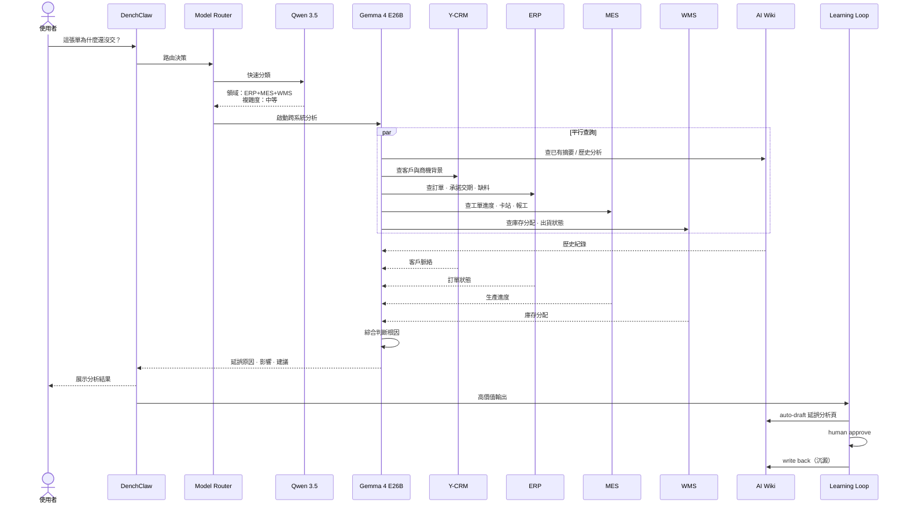
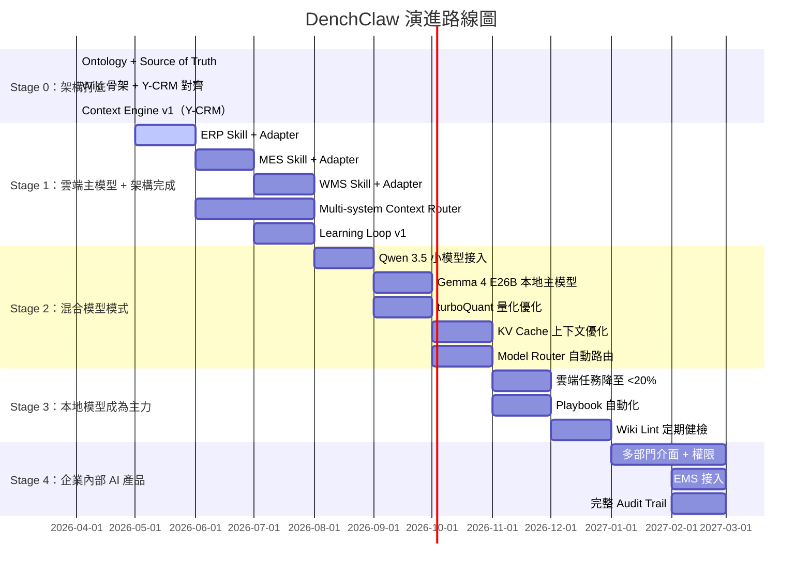

# DenchClaw 未來架構（Future Architecture with Local AI）

> 產生日期：2026-04-17
> 狀態：規劃版
> 目標：企業內部 AI 產品 — 本地模型主力 + 多系統融合

---

## 總覽架構圖

```mermaid
graph TB
    %% ===== Layer 1: Experience Layer =====
    subgraph L1["Layer 1 · Experience Layer（使用者互動層）"]
        Browser["🌐 瀏覽器"]
        WebUI["DenchClaw Web UI<br/>Next.js · React<br/>Port 3100"]
        Chat["Chat Panel<br/>AI 對話"]
        Workspace["Workspace<br/>資料表 · 編輯器"]
        Dashboard["Dashboard<br/>跨系統報表"]
        EntityCard["Entity Card<br/>客戶 · 訂單 · 工單 · 庫存"]
        Timeline["Timeline<br/>跨系統事件流"]
        RiskPanel["寫入風險面板<br/>L0-L4 確認機制"]
    end

    Browser --> WebUI
    WebUI --> Chat
    WebUI --> Workspace
    WebUI --> Dashboard
    WebUI --> EntityCard
    WebUI --> Timeline
    WebUI --> RiskPanel

    %% ===== Layer 2: Agent Runtime Layer =====
    subgraph L2["Layer 2 · Agent Runtime Layer（Hermes Agent 模式）"]
        Gateway["OpenClaw Gateway<br/>Port 19001"]
        Planner["Planner / Orchestrator<br/>跨系統任務編排"]
        Subagents["Subagents<br/>平行子代理"]
        Cron["Cron<br/>每日營運摘要 · 異常監測"]
        Session["Session Memory"]
        Tools["工具層"]
        ToolExec["exec"]
        ToolRead["read"]
        ToolWeb["web"]
    end

    Chat --> Gateway
    Gateway --> Planner
    Planner --> Subagents
    Gateway --> Cron
    Gateway --> Session
    Gateway --> Tools
    Tools --> ToolExec
    Tools --> ToolRead
    Tools --> ToolWeb

    %% ===== Model Router Layer (NEW) =====
    subgraph ModelRouter["Model Router Layer（智慧模型路由 🆕）"]
        Router["Model Router<br/>依任務複雜度自動選擇"]

        subgraph LocalSmall["🖥️ 本地小模型"]
            Qwen["Qwen 3.5<br/>快速分類 · 路由<br/>意圖辨識 · query rewrite<br/>metadata 抽取"]
        end

        subgraph LocalMain["🖥️ 本地主模型"]
            Gemma["Gemma 4 E26B<br/>via Ollama<br/>跨系統分析 · SOP 推導<br/>根因分析 · 內部報告"]
            TurboQuant["Google turboQuant<br/>量化優化<br/>降低推理資源消耗"]
            KVCache["KV Cache Reuse<br/>上下文成本優化<br/>固定模板 · wiki 頁 · 系統上下文"]
        end

        subgraph CloudModel["☁️ 雲端模型（僅複雜任務）"]
            CloudLLM["GPT-4.1 / Claude / etc.<br/>複雜推理 · 高價值報告<br/>策略分析（最少量使用）"]
        end

        MacMini["Mac mini M4<br/>本地推理主機<br/>常駐 agent · 排程任務<br/>wiki 維護"]
    end

    Gateway --> Router
    Router -->|"簡單：分類/路由/摘要"| Qwen
    Router -->|"中等：分析/報告/SOP"| Gemma
    Router -->|"複雜：策略/高價值"| CloudLLM
    TurboQuant --> Gemma
    KVCache --> Gemma
    MacMini --> Qwen
    MacMini --> Gemma

    %% ===== Layer 3: Enhanced Context Engine =====
    subgraph L3["Layer 3 · Enhanced Context Engine（增強上下文引擎 🆕）"]
        ContextEngine["Multi-System Context Engine<br/>跨系統意圖辨識<br/>優先級路由"]
        Classifier["Intent / Domain Classifier<br/>CRM? ERP? MES? WMS?"]
        ContextBuilder["Context Builder<br/>動態選材 · 精準組裝"]
        ContextPack["Context Pack<br/>結構化 prompt 區塊"]
        Memory["Memory Layer<br/>使用者偏好 · 對話摘要<br/>慣用術語 · 常追蹤對象"]
    end

    Gateway --> ContextEngine
    ContextEngine --> Classifier
    Classifier --> ContextBuilder
    ContextBuilder --> ContextPack
    ContextEngine --> Memory
    ContextPack --> Gateway

    %% ===== Skill System =====
    subgraph Skills["Domain Skills（領域技能）"]
        Identity["IDENTITY.md<br/>系統契約"]
        YCRM_Skill["ycrm<br/>客戶 · 商機 · LINE"]
        ERP_Skill["erp 🆕<br/>訂單 · 採購 · 庫存 · 財務"]
        MES_Skill["mes 🆕<br/>工單 · 製程 · 設備 · 良率"]
        WMS_Skill["wms 🆕<br/>庫位 · 批號 · 揀貨 · 波次"]
        EMS_Skill["ems 🆕<br/>能源 · 設備 · 環境監控"]
        CRM_Skill["crm<br/>通用 CRM 操作"]
    end

    Gateway --> Identity
    ContextBuilder --> YCRM_Skill
    ContextBuilder --> ERP_Skill
    ContextBuilder --> MES_Skill
    ContextBuilder --> WMS_Skill
    ContextBuilder --> EMS_Skill

    %% ===== Layer 4: Mature Knowledge Layer =====
    subgraph L4["Layer 4 · Canonical Knowledge Layer（成熟知識層 🆕）"]
        subgraph WikiMature["AI Wiki（成熟版）"]
            WikiIngest["Ingest<br/>讀取來源 → 產生摘要<br/>更新 index → 寫入 log"]
            WikiQuery["Query<br/>先查 wiki → 必要才查原始系統<br/>新分析寫回 wiki"]
            WikiLint["Lint<br/>找矛盾 · 找過期 · 找孤兒頁<br/>找重複概念 · 檢查標記"]
        end

        Ontology["Canonical Ontology<br/>16+ 跨系統企業物件<br/>Customer · SalesOrder<br/>WorkOrder · InventoryLot · ..."]
        SOT["Source of Truth Rules<br/>客戶→CRM · 訂單→ERP<br/>工單→MES · 庫位→WMS"]
        Playbooks["Playbooks / SOPs<br/>追交期延誤 · 查庫存差異<br/>查缺料原因 · 客訴追溯"]

        subgraph ThreeTier["三層知識結構"]
            Raw["raw/<br/>原始來源（不可修改）"]
            Wiki["wiki/<br/>AI 維護的知識頁"]
            Schema["schema/<br/>規範 AI 行為"]
        end
    end

    ContextBuilder --> WikiQuery
    WikiIngest --> Wiki
    WikiLint --> Wiki
    Raw --> WikiIngest

    %% ===== Layer 5: Unified Adapter Layer =====
    subgraph L5["Layer 5 · Unified Adapter Layer（統一接入層 🆕）"]
        AdapterInterface["SystemAdapter Interface<br/>discoverSchema() · searchEntities()<br/>query() · executeAction()<br/>explainConflict()"]

        YCRM_Adapter["Y-CRM Adapter<br/>DuckDB + REST + GraphQL"]
        ERP_Adapter["ERP Adapter 🆕<br/>postgres_scanner"]
        MES_Adapter["MES Adapter 🆕<br/>postgres_scanner"]
        WMS_Adapter["WMS Adapter 🆕<br/>postgres_scanner"]
        EMS_Adapter["EMS Adapter 🆕<br/>TBD"]

        subgraph WriteRisk["寫入風險分級 🆕"]
            L0["L0 純讀取<br/>直接允許"]
            L1_Risk["L1 低風險<br/>可預設允許"]
            L2_Risk["L2 一般業務<br/>顯示確認"]
            L3_Risk["L3 高風險營運<br/>人工確認 + audit"]
            L4_Risk["L4 關鍵寫入<br/>禁止或雙重授權"]
        end
    end

    ToolExec --> YCRM_Adapter
    ToolExec --> ERP_Adapter
    ToolExec --> MES_Adapter
    ToolExec --> WMS_Adapter
    ToolExec --> EMS_Adapter
    YCRM_Adapter --> AdapterInterface
    ERP_Adapter --> AdapterInterface
    MES_Adapter --> AdapterInterface
    WMS_Adapter --> AdapterInterface
    RiskPanel --> WriteRisk

    %% ===== Layer 6: Multi-System of Record =====
    subgraph L6["Layer 6 · Systems of Record（多系統真實資料層）"]
        YCRM_DB[("Y-CRM<br/>PostgreSQL<br/>:5432<br/>客戶 · 商機 · LINE")]
        ERP_DB[("ERP<br/>PostgreSQL/MySQL<br/>:5433<br/>訂單 · 採購 · 財務")]
        MES_DB[("MES<br/>PostgreSQL<br/>:5434<br/>工單 · 製程 · 設備")]
        WMS_DB[("WMS<br/>PostgreSQL<br/>:5435<br/>庫位 · 批號 · 揀貨")]
        EMS_DB[("EMS<br/>TBD<br/>能源 · 環境")]
    end

    YCRM_Adapter -->|"READ_ONLY"| YCRM_DB
    ERP_Adapter -->|"READ_ONLY"| ERP_DB
    MES_Adapter -->|"READ_ONLY"| MES_DB
    WMS_Adapter -->|"READ_ONLY"| WMS_DB
    EMS_Adapter --> EMS_DB

    %% ===== Mature Learning Loop =====
    subgraph LLoop["Learning Loop（成熟版 🆕）"]
        MemoryLearn["Memory Learning<br/>偏好 · 別名 · 慣用流程"]
        WikiLearn["Wiki Learning<br/>客戶摘要 · 異常分析<br/>月度洞察"]
        SkillLearn["Skill Learning<br/>新欄位對照 · SQL pattern<br/>錯誤處理"]
        PlaybookLearn["Playbook Learning<br/>跨系統 SOP 固化"]
        Governance["Governance<br/>auto-draft → human approve<br/>→ write back"]
    end

    Gateway -->|"高價值輸出"| Governance
    Governance --> MemoryLearn
    Governance --> WikiLearn
    Governance --> SkillLearn
    Governance --> PlaybookLearn
    MemoryLearn --> Memory
    WikiLearn --> Wiki
    SkillLearn --> YCRM_Skill
    PlaybookLearn --> Playbooks

    %% ===== Styling =====
    classDef layer1 fill:#dbeafe,stroke:#3b82f6,stroke-width:2px
    classDef layer2 fill:#fef3c7,stroke:#f59e0b,stroke-width:2px
    classDef layer3 fill:#d1fae5,stroke:#10b981,stroke-width:2px
    classDef layer4 fill:#ede9fe,stroke:#8b5cf6,stroke-width:2px
    classDef layer5 fill:#fce7f3,stroke:#ec4899,stroke-width:2px
    classDef layer6 fill:#f3f4f6,stroke:#6b7280,stroke-width:2px
    classDef newFeature fill:#fef9c3,stroke:#eab308,stroke-width:3px
    classDef local fill:#dcfce7,stroke:#16a34a,stroke-width:3px
    classDef cloud fill:#fff7ed,stroke:#f97316,stroke-width:2px

    class Browser,WebUI,Chat,Workspace,Dashboard,EntityCard,Timeline,RiskPanel layer1
    class Gateway,Planner,Subagents,Cron,Session,Tools,ToolExec,ToolRead,ToolWeb layer2
    class ContextEngine,Classifier,ContextBuilder,ContextPack,Memory layer3
    class WikiIngest,WikiQuery,WikiLint,Ontology,SOT,Playbooks,Raw,Wiki,Schema layer4
    class AdapterInterface,YCRM_Adapter,ERP_Adapter,MES_Adapter,WMS_Adapter,EMS_Adapter layer5
    class YCRM_DB,ERP_DB,MES_DB,WMS_DB,EMS_DB layer6
    class Router,Qwen,Gemma,TurboQuant,KVCache,MacMini local
    class CloudLLM cloud
```

---

## 模型路由決策流程

---

## 跨系統工作流範例：訂單延誤分析

---

## 演進階段

---

## 現在 vs 未來 對照表

| 面向 | 目前架構 | 未來架構 |
|------|----------|----------|
| **AI 模型** | ☁️ OpenAI GPT-4.1-mini（主要） 🖥️ Ollama gemma4:e2b（備援） | 🖥️ Qwen 3.5（路由/分類） 🖥️ Gemma 4 E26B（主力） ☁️ 雲端模型（僅複雜任務） |
| **模型路由** | 手動切換 | 自動路由（依複雜度） |
| **推理優化** | 無 | turboQuant + KV Cache Reuse |
| **推理主機** | 開發機 | Mac mini M4（常駐） |
| **外部系統** | Y-CRM（唯一） | Y-CRM + ERP + MES + WMS + EMS |
| **Adapter** | 直接 DuckDB 查詢 | 統一 SystemAdapter 介面 |
| **知識層** | Wiki 骨架（初版） | 成熟 AI Wiki（ingest/query/lint） |
| **Ontology** | 初版（Y-CRM 為主） | 16+ 跨系統企業物件 |
| **Context Engine** | Y-CRM 單系統路由 | 多系統優先級路由 |
| **寫入控制** | 無分級 | L0-L4 風險分級 |
| **Learning Loop** | 概念階段 | auto-draft → approve → write back |
| **Playbooks** | 無 | 跨系統 SOP 自動固化 |
| **資料隱私** | 敏感資料過雲端 | 本地推理，資料不出內網 |
| **成本** | 按 API 用量計費 | 高頻任務本地化，成本可控 |
| **使用者** | 工程師 / 管理者 | 業務 · 內勤 · 採購 · 生管 · 倉管 |
